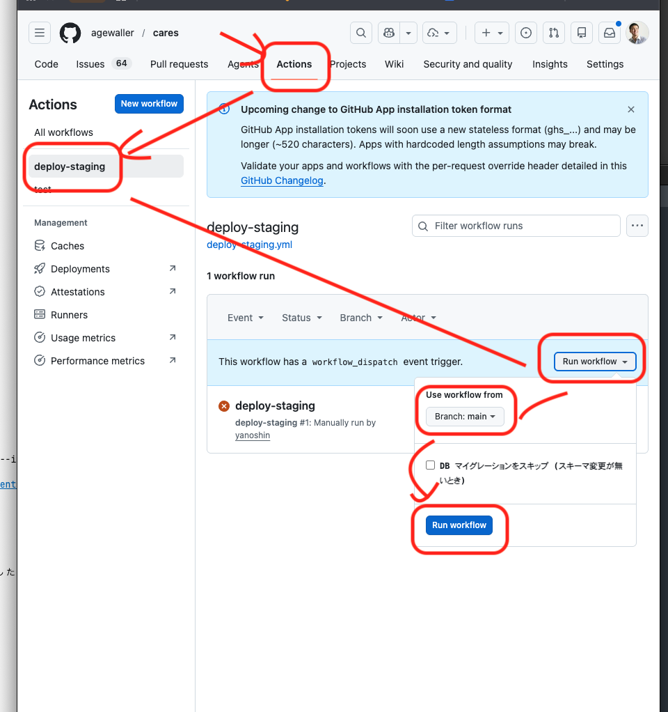

# GitHub Actions で staging に手動デプロイする（簡易マニュアル）

`deploy-staging` ワークフローを GitHub の画面から手動実行して、staging 環境
（Cloud Run `cares-*-staging` / Cloud SQL `cares-db-staging`）へデプロイする手順。
**PC でもスマホの GitHub アプリ/ブラウザでも同じ操作**で実行できる。

> 自動化の中身（WIF 認証・2 ゲート・SQL 起動停止）の解説は
> [`.github/workflows/deploy-staging.yml`](../.github/workflows/deploy-staging.yml) のコメントと
> [`infra/scripts/README.md`](../infra/scripts/README.md) を参照。

---

## まず一度だけ（セットアップ済みなら飛ばす）

手動デプロイには、以下が **リポジトリに 1 回だけ** 登録されている必要がある。

- **リポジトリ Variables**（Settings → Secrets and variables → Actions → Variables）
  - `WIF_PROVIDER` / `DEPLOY_SA` … GCP への鍵レス認証（WIF）用
  - `NEXT_PUBLIC_FIREBASE_API_KEY` / `…_AUTH_DOMAIN` / `…_PROJECT_ID` … Web ビルド用の公開 Firebase 設定
  - 生成元: `bash infra/scripts/11-setup-github-wif.sh`（GCP 側構築 + 上記値の表示。冪等）
- **（任意）承認ゲート**: Settings → Environments → `staging` → Required reviewers に承認者を追加すると、
  デプロイ前に承認待ちで止まる（admin 権限が必要）。未設定ならテスト green 後そのまま自動で進む。

> 登録漏れで `Authenticate to GCP (WIF)` が
> `must specify exactly one of "workload_identity_provider"…` で失敗する場合は Variables 未登録。

---

## 手順

下図の①→⑤の順にたどる。

1. **① Actions** タブを開く。
2. 左サイドバーの **② `deploy-staging`** を選ぶ。
3. 右側の **③ `Run workflow`** ボタンを押す。
4. **④ Use workflow from** が **`Branch: main`** になっていることを確認（通常はそのまま）。
5. 必要に応じて入力を設定し、**⑤ `Run workflow`**（青ボタン）を押す → デプロイ開始。

### 実行時の入力オプション

| 入力 | 既定 | 使いどころ |
|---|---|---|
| **DB マイグレーションをスキップ** (`skip_migrate`) | OFF | スキーマ変更が無い回はチェックして migrate を飛ばす。スキーマを変えたなら OFF のまま |
| **デプロイ後に SQL を停止** (`stop_sql_after`) | OFF | 通常は OFF（チーム検証中は staging DB を動かしっぱなしにする運用）。検証が完全に終わってコストを抑えたいときだけ ON |

> 上の画像は撮影時点のもので、`stop_sql_after` のチェックボックスが写っていないことがある。
> 実際の画面に表示される入力に従う。

---

## 実行されること（2 ゲート）

1. **`test` ジョブ**（unit + integration、実 Postgres）。**green でないと deploy に進まない**。
2. **`deploy` ジョブ**（`environment: staging`）。承認ゲートを設定していれば、ここで承認待ちになる
   （承認すると進む。スマホからも承認可）。
   - WIF で GCP 認証 → Cloud SQL 起動（RUNNABLE 待ち）→ migrate → イメージ build/push →
     Cloud Run へ api→web デプロイ → health/CORS を実測（非致命）→
     `stop_sql_after=ON` のときだけ SQL 停止。

---

## デプロイ後の確認

- 実行ログ: 各ステップが緑か、`Verify health & CORS` の出力に
  `access-control-allow-origin` が出ているか。
- 動作確認:
  - API health: <https://cares-api-staging-xj6szhutkq-an.a.run.app/api/healthz> → `{"status":"ok"}`
  - サイト: <https://stg-cares.advisers.jp> でログイン → 記帳が通るか 1 回実測。

---

## うまくいかないとき

| 症状 | 原因 / 対処 |
|---|---|
| `Authenticate to GCP (WIF)` で `must specify exactly one of "workload_identity_provider"…` | リポジトリ Variables `WIF_PROVIDER` / `DEPLOY_SA` 未登録。`11-setup-github-wif.sh` の出力値を登録 |
| `Migrate staging DB` が `P1001 Can't reach database` / `cloud-sql-proxy: syntax error` | proxy バイナリの取得失敗（バージョンが GCS から消えていると 404）。`deploy-staging.yml` の proxy バージョンを更新 |
| デプロイ後、サイトが「ログインの有効期限が切れました。再ログインを」 | staging Cloud SQL が停止中で DB に届いていない。`gcloud sql instances patch cares-db-staging --activation-policy=ALWAYS` で起動 → [incidents/2026-06-16](incidents/2026-06-16-staging-login-expired-sql-stopped.md) |
| 記帳が 500 / 画面に `… is not valid JSON` | 暗号化鍵 `DATA_ENCRYPTION_KEY` 未配線 → [incidents/2026-06-09](incidents/2026-06-09-staging-quick-entry-data-encryption-key-missing.md) |

---

## 関連

- staging 環境の全体像・リソース一覧・運用ルール: [`OPERATIONS.md` §7.9](OPERATIONS.md#79-staging-環境-adr-0015-同一プロジェクト共存)
- 同一プロジェクト共存方式の決定: [ADR-0015](adr/0015-staging-environment-in-prod-project.md)
- ローカル（Claude Code）からの staging デプロイ: リポジトリ [`CLAUDE.md`](../CLAUDE.md) 「ステージングデプロイしてください」
