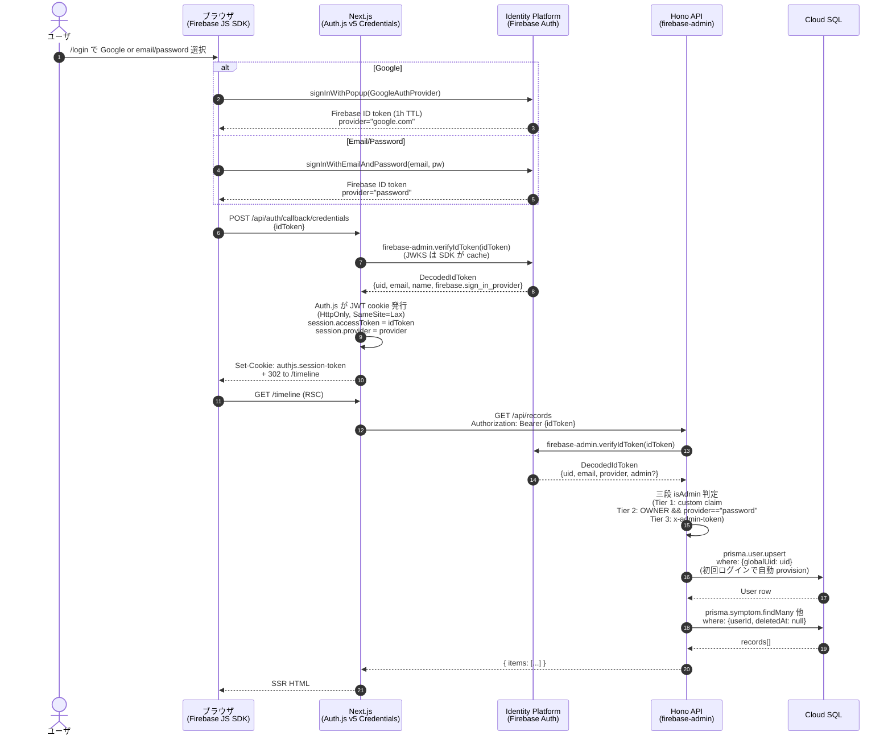

# シーケンス: ログイン (Identity Platform → Auth.js セッション)

[ADR-0014](../../adr/0014-auth-switch-to-identity-platform.md) に従う実装。Google ログインと email/password の両方を 1 つのシーケンスで表す (provider 部分のみ分岐)。

## ポイント

- **ブラウザは ID token を直接 API に投げない**: Auth.js Credentials provider 経由で HttpOnly cookie に格納してから、SSR の RSC が `Authorization: Bearer` で API を呼ぶ。これにより `Cache-Control: no-store` の HTML 経路と整合
- **ID token は 1h TTL**: ブラウザ滞在が長くなると API 呼び出しで `expired` 401。Firebase SDK が refresh token で自動更新するが、Auth.js cookie 内の値は古いまま。長時間使う画面 (写真アップロード等) では `getCurrentIdToken()` で都度 fresh token を取り直す
- **Tier 2 の核心**: `OWNER_EMAIL && provider==="password"` の場合のみ admin。Google ログインで管理画面に入れない仕様 (ADR-0011 改訂)
- **break-glass (Tier 3)**: Firebase 完全停止時の救済。`x-admin-token` ヘッダ付き curl で API を直接叩く CLI 経路
- **初回ログイン**: `prisma.user.upsert` が User 行を自動作成 (`globalUid` = Firebase UID、`email`, `displayName` を Firebase から)

## 実装参照

- `apps/web/lib/firebase-client.ts` — Firebase JS SDK init + signIn helper
- `apps/web/components/LoginCard.tsx` — ログイン UI
- `apps/web/auth.ts` — Auth.js v5 Credentials provider
- `apps/web/auth.config.ts` — Edge-safe な NextAuth 設定 (middleware から import)
- `apps/api/src/index.ts` (auth middleware 内) — firebase-admin で ID token verify + 三段 admin 判定 + user upsert
