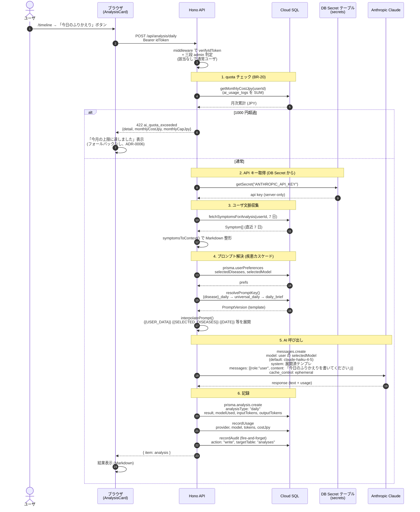

# シーケンス: 日次ふりかえり (AI 分析)

FN-AI-01 (日々のふりかえり) + BR-20 (月次 1000 円キャップ)。[ADR-0006](../../adr/0006-ai-provider-strategy.md) (フォールバック禁止)。

## ポイント

- **quota チェックは API 内で最初に**: 失敗時は **422** を返してフォールバックなし ([ADR-0006](../../adr/0006-ai-provider-strategy.md) フォールバック連鎖禁止)。`monthlyCostJpy` / `monthlyCapJpy` を返してフロントが説明可能
- **API キーは DB の `secrets` テーブル** に保管 ([ADR-0011](../../adr/0011-admin-model-with-failsafe.md) のシークレット原則): ブラウザに絶対漏らさず、管理画面では `isSet: true/false` のみ返す。実装は `getSecret(name)` で server-only に閉じる
- **プロンプトは DB 駆動 + 疾患カスケード**:
  - ユーザの疾患選択を優先 (`{disease}_daily` → `mecfs_daily` 等の 135 件)
  - なければ `universal_daily`
  - それも無ければ `daily_brief` (短文版、フォールバック用)
  - 157 件すべて `prompts` テーブルに seed 済 (旧 stock-screener から移植)
- **モデルはユーザ選択**: `UserPreferences.selectedModel` (default: Haiku)。`AVAILABLE_MODELS` に無いと DEFAULT にフォールバック
- **interpolatePrompt の置換変数**: `{{RESPOND_LANGUAGE_INSTRUCTION}}` / `{{DATE}}` / `{{SELECTED_DISEASES}}` / `{{USER_DATA}}` (記録 markdown) / `{{PERIOD_DAYS}}` 等。旧 stock-screener の `ai-engine.js` 由来
- **prompt caching**: `cache_control: { type: "ephemeral" }` で system 部分をキャッシュ。同じ system prompt で複数ユーザ叩く時にコスト削減
- **monthly reset**: `firstDayOfThisMonthUTC()` で集計。UTC 月初リセット (BR-20)

## 関連エンドポイント

- `GET /api/analysis/today` — 当日の分析取得 (生成済みなら既存返却)
- `POST /api/analysis/daily` — 本シーケンス
- `POST /api/analysis/deep` — 深堀ふりかえり (1 日 1 回、`weekly` 系プロンプト使用)
- `POST /api/analysis/research` — 研究分析 (疾患固有 `{disease}_research` 必須)
- `POST /api/reports` — 医師 / SNS / 家族向けレポート (`report_doctor` 等の固定プロンプト)

## 実装参照

- `apps/api/src/index.ts` — `POST /api/analysis/daily` ハンドラ
- `apps/api/src/prompt-runtime.ts` — `getPromptText` / `resolvePromptKey` / `interpolatePrompt`
- `apps/api/src/legacy-prompts.json` + `extra-prompts.json` — 157 件のプロンプト seed
