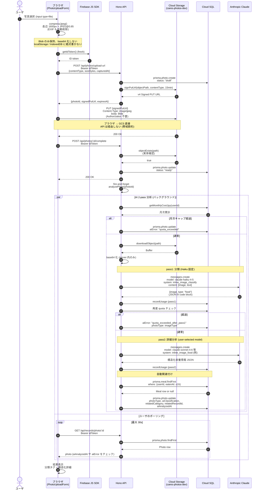

# シーケンス: 写真アップロード + AI 2-pass 分析

FN-DIARY-02 (写真カテゴリ) + FN-AI-04 (画像解析)。[ADR-0007](../../adr/0007-browser-pii-prohibition.md) (画像も PII) を厳守。

## ポイント

- **Signed URL 直接 PUT** で ブラウザ → GCS。サーバを介さず帯域効率良い + 大きい画像でも API 負荷ゼロ
- **EXIF 自動削除**: `createImageBitmap` + `drawImage` (Canvas) で再描画すると EXIF は保持されない (位置情報 / 撮影日時 / 機種が削除される)
- **base64 はサーバ内のみ**: クライアントは Blob のまま GCS に PUT、API が Anthropic Vision に投げる時だけサーバで base64 化
- **2-pass パイプライン**: pass1 で `image_type` を Haiku 軽量分類 → pass2 で type 別の専用プロンプト (`inline_image_food` 等) を user-selected model で詳細分析。旧 stock-screener のパターン継承
- **月次キャップ尊重 (BR-20)**: pass1 前と pass2 前の両方で `getMonthlyCostJpy()` チェック。超過時は分析スキップして写真自体は保存 (`aiError` だけ記録)
- **自動関連付け**: `image_type==="food"` → ±1h 以内の Meal record と link、`blood_test` → ±1d 以内の BloodTest、etc.
- **表示時は Signed GET URL (5 min)**: 別シーケンス。`PhotoCard` コンポーネントが `URL.createObjectURL(blob)` で blob URL 化 → unmount で `revokeObjectURL`
- **削除時の GCS 同期**: ソフト削除すると `bucket.file().move()` で `deleted/` prefix に rename → 30 日後 lifecycle で物理削除 (フェイルセーフ)

## 実装参照

- `apps/web/lib/photo-upload.ts` — compressJpeg + putToSignedUrl
- `apps/web/components/PhotoUploadForm.tsx` — UI + 分析ポーリング
- `apps/web/components/PhotoCard.tsx` — 表示 (blob URL → unmount revoke)
- `apps/api/src/index.ts` — 4 endpoints (`/api/photos/upload-url`, `/:id/complete`, `/:id/signed-url`, `GET /api/photos`)
- `apps/api/src/gcs.ts` — Signed URL ヘルパー + GCS object 操作
- `apps/api/src/photo-analyzer.ts` — 2-pass パイプライン + 自動関連付け
