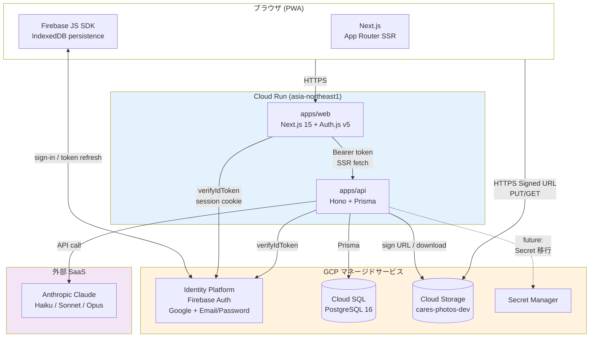

# cares システム全体構成

cares (健康日記) の論理アーキテクチャと外部依存。実装フェーズ 5 (機能移植) 完了時点の現状。

## 1. 論理コンポーネント図

**凡例**:
- 実線: HTTPS / API call
- 点線: 将来予定 (Secret Manager 統合は MVP では DB Secret テーブルで代替)

## 2. デプロイメント環境

| 環境 | 状態 | ホスト |
|---|---|---|
| **local dev** | ✅ 稼働中 | Docker Compose 3 サービス (cares-db / api / web) on localhost |
| **staging** | ✅ 構築済 (2026-06-02) | Cloud Run + Cloud SQL (`-staging` 接尾辞、本番と同一プロジェクト共存 / [ADR-0015](../adr/0015-staging-environment-in-prod-project.md))。SQL は設計上オンデマンド起動 |
| **prod** | ✅ 稼働中 (フェーズ 6 最小構成) | Cloud Run + Cloud SQL + GCS + Secret Manager (Cloud LB + Cloud Armor は将来 / ADR-0013 S-1) |

dev では認証も GCS も**本物の GCP リソース**を使う (Firebase Auth Emulator は採用していない、ADR-0014)。

## 3. 主要データフロー

| フロー | 詳細図 |
|---|---|
| ログイン (Google / Email-Password) | [sequence/auth-login.md](sequence/auth-login.md) |
| 写真アップロード + AI 2-pass 分析 | [sequence/photo-upload.md](sequence/photo-upload.md) |
| 日次ふりかえり (AI 分析、quota チェック) | [sequence/daily-analysis.md](sequence/daily-analysis.md) |

## 4. データの所在

| データ種別 | 保管先 | 暗号化 | ソフト削除 | ハード削除 |
|---|---|---|---|---|
| ユーザ profile / 記録 (10 カテゴリ) | Cloud SQL | フィールド暗号化は別タスク (text_entries.content など) | ✅ deleted_at | 30 日後 GC (未実装) |
| 写真本体 | Cloud Storage (`gs://cares-photos-dev/photos/{userId}/{photoId}.jpg`) | Google 管理鍵 (CMEK は MVP では未採用) | ✅ `deleted/` prefix に rename | bucket lifecycle で 30 日後物理削除 |
| AI 解析結果 | Cloud SQL `analyses` | 平文 | ✅ | 30 日後 GC (未実装) |
| 監査ログ | Cloud SQL `audit_logs` | 平文 (PII を最小化、`visible_to_user` で本人開示制御) | なし (保管期間別ポリシー) | 別途 retention |
| 認証 (Firebase UID / refresh token) | Firebase 側 (Google が管理) | Google が管理 | — | — |
| ブラウザ側 PII | **保管しない** ([ADR-0007](../adr/0007-browser-pii-prohibition.md)) | — | — | タブクローズで blob URL 解放 |

## 5. 主要 ADR との対応

| ADR | 対応コンポーネント | 状態 |
|---|---|---|
| [ADR-0001](../adr/0001-rearchitecture-from-firebase-to-gcp.md) リアーキテクチャ動機 | システム全体 | ✅ 実装中 |
| [ADR-0003](../adr/0003-frontend-stack-nextjs.md) Frontend stack | apps/web | ✅ 実装済 |
| [ADR-0004](../adr/0004-backend-stack-typescript-hono-prisma.md) Backend stack | apps/api | ✅ 実装済 |
| [ADR-0005](../adr/0005-gcp-services-and-environments.md) GCP services | Cloud Run / SQL / GCS / Secret Manager | ✅ prod + staging 稼働 (プロジェクト分離は ADR-0015 方式に変更) |
| [ADR-0006](../adr/0006-ai-provider-strategy.md) AI provider | Anthropic 単一、フォールバック禁止 | ✅ 実装済 |
| [ADR-0007](../adr/0007-browser-pii-prohibition.md) ブラウザに PII 置かない | フロント全般、特に写真表示 | ✅ 実装済 |
| [ADR-0011](../adr/0011-admin-model-with-failsafe.md) admin 三段 | API middleware | ✅ ADR-0014 で改訂版実装 |
| [ADR-0013](../adr/0013-2026-05-27-operational-supplements.md) 運用補足束 | 各所 | ✅ 該当部分実装 |
| [ADR-0014](../adr/0014-auth-switch-to-identity-platform.md) 認証切替 | Identity Platform | ✅ 実装済 |
| [ADR-0015](../adr/0015-staging-environment-in-prod-project.md) staging 同一プロジェクト共存 | infra/scripts (`CARES_ENV=staging` オーバーレイ) | ✅ 構築済 |
| [ADR-0016](../adr/0016-public-trial-ai-endpoint.md) お試し AI 公開エンドポイント | `POST /api/trial/analyze` + トップ画面フォーム | ✅ 実装済 |

## 6. 未実装 (フェーズ 5 残作業)

- text_entries.content / ai_messages.content の AES-GCM フィールド暗号化
- 30 日経過の物理削除 GC ジョブ (Cloud Scheduler + Cloud Run jobs)
- CSV / PDF / FHIR エクスポート (現状 JSON のみ)
- 通知の実配信 (SendGrid 等、現状はキャンペーン保管のみ)
- AI runtime の DB 駆動モデル切替 (現状はハードコード `AVAILABLE_MODELS`)
- 旧 Firebase Storage からの写真物理移行 (本番デプロイ時、ADR-0010)
