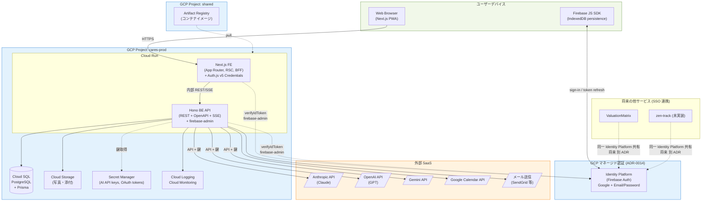

# component

```mermaid
%% コンポーネント図: cares 新仕様の全体構成
%% ADR-0001〜0014 と整合 (認証は ADR-0014: GCP Identity Platform / Firebase Auth)
%% 現行実装の確定図は ../../architecture/system-overview.md を参照

flowchart TB
    subgraph User["ユーザーデバイス"]
        Browser["Web Browser<br/>(Next.js PWA)"]
        FBSDK["Firebase JS SDK<br/>(IndexedDB persistence)"]
    end

    subgraph CaresProd["GCP Project: cares-prod"]
        direction TB
        subgraph CaresRun["Cloud Run"]
            FE["Next.js FE<br/>(App Router, RSC, BFF)<br/>+ Auth.js v5 Credentials"]
            BE["Hono BE API<br/>(REST + OpenAPI + SSE)<br/>+ firebase-admin"]
        end
        CaresDB[("Cloud SQL<br/>PostgreSQL<br/>+ Prisma")]
        CaresStorage["Cloud Storage<br/>(写真・添付)"]
        CaresSecrets["Secret Manager<br/>(AI API keys, OAuth tokens)"]
        CaresLog["Cloud Logging<br/>Cloud Monitoring"]
    end

    subgraph IdentityManaged["GCP マネージド認証 (ADR-0014)"]
        IDP["Identity Platform<br/>(Firebase Auth)<br/>Google + Email/Password"]
    end

    subgraph SharedProj["GCP Project: shared"]
        Artifact["Artifact Registry<br/>(コンテナイメージ)"]
    end

    subgraph External["外部 SaaS"]
        Anthropic[/"Anthropic API<br/>(Claude)"/]
        OpenAI[/"OpenAI API<br/>(GPT)"/]
        Gemini[/"Gemini API"/]
        GCal[/"Google Calendar API"/]
        Mail[/"メール送信<br/>(SendGrid 等)"/]
    end

    subgraph OtherSvc["将来の他サービス (SSO 連携)"]
        VM["ValuationMatrix"]
        ZT["zen-track (未実装)"]
    end

    %% ブラウザ通信
    Browser -->|HTTPS| FE
    FBSDK <-->|sign-in / token refresh| IDP

    %% FE/BE 経路
    FE -->|内部 REST/SSE| BE
    FE -.->|verifyIdToken<br/>firebase-admin| IDP

    %% BE → データ
    BE --> CaresDB
    BE --> CaresStorage
    BE -.->|鍵取得| CaresSecrets
    BE --> CaresLog
    BE -.->|verifyIdToken<br/>firebase-admin| IDP

    %% BE → AI Provider
    BE -->|API + 鍵| Anthropic
    BE -->|API + 鍵| OpenAI
    BE -->|API + 鍵| Gemini

    %% BE → 連携サービス
    BE --> GCal
    BE --> Mail

    %% SSO で繋がる他サービス (将来: 同一 Identity Platform を共有する形で再設計、ADR-0014)
    VM -.->|同一 Identity Platform 共有<br/>将来 別 ADR| IDP
    ZT -.->|同一 Identity Platform 共有<br/>将来 別 ADR| IDP

    %% コンテナイメージ
    Artifact -.->|pull| CaresRun

    %% スタイル
    classDef gcp fill:#e3f2fd,stroke:#1976d2
    classDef extsaas fill:#fff3e0,stroke:#f57c00
    classDef user fill:#f1f8e9,stroke:#558b2f
    class CaresProd,IdentityManaged,SharedProj gcp
    class External extsaas
    class User user
```
