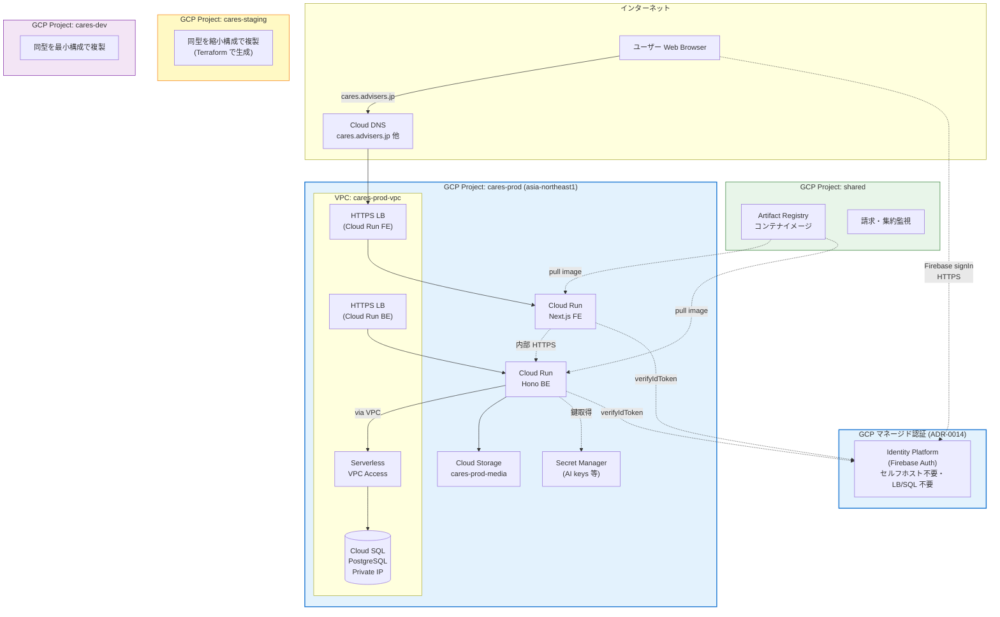

# deployment

> **実装状況 (2026-06-01)**: 本図は**目標構成（フェーズ 7 以降）**。現在のフェーズ 6 最小構成は
> 単一プロジェクト `arctic-anvil-497002-q2` + Cloud Run 直公開（LB / VPC / staging / dev プロジェクトなし）。
> 現状の実構成図は [`../../architecture/system-overview.md`](../../architecture/system-overview.md) を参照。

