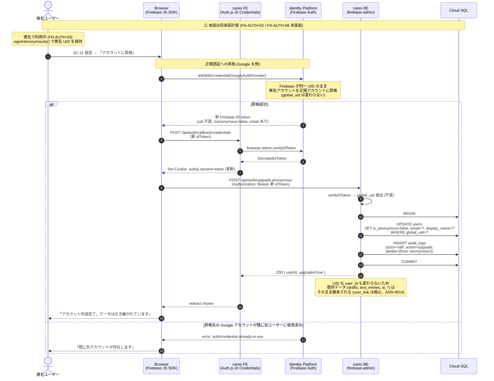

# sequence-anonymous-upgrade

```mermaid
%% シーケンス図: 匿名アカウント → 正規アカウント昇格 (将来設計案)
%% FN-AUTH-08, BR-22, ADR-0014 と整合
%% ⚠ FN-AUTH-03 (匿名ログイン) / FN-AUTH-08 (昇格) は設計のみ・未実装
%% Firebase の signInAnonymously / linkWithCredential を使う前提 (UID は昇格後も不変)

sequenceDiagram
    autonumber
    actor U as 匿名ユーザー
    participant B as Browser<br/>(Firebase JS SDK)
    participant FE as cares FE<br/>(Auth.js v5 Credentials)
    participant IDP as Identity Platform<br/>(Firebase Auth)
    participant BE as cares BE<br/>(firebase-admin)
    participant DB as Cloud SQL

    Note over U,DB: ⚠ 本図は将来設計案 (FN-AUTH-03 / FN-AUTH-08 未実装)

    Note over U: 匿名で利用中 (FN-AUTH-03)<br/>signInAnonymously() で匿名 UID を保持
    U->>B: SC-11 設定 → 「アカウントに昇格」

    Note over B,IDP: 正規認証への昇格 (Google を例)
    B->>IDP: linkWithCredential(GoogleAuthProvider)
    Note over IDP: Firebase が同一 UID のまま<br/>匿名アカウントを正規アカウントに昇格<br/>(global_uid は変わらない)

    alt 昇格成功
        IDP-->>B: 新 Firebase ID token<br/>(uid 不変, isAnonymous=false, email あり)
        B->>FE: POST /api/auth/callback/credentials<br/>{新 idToken}
        FE->>IDP: firebase-admin.verifyIdToken
        IDP-->>FE: DecodedIdToken
        FE-->>B: Set-Cookie: authjs.session-token (更新)

        B->>BE: POST /api/auth/upgrade-anonymous<br/>(Authorization: Bearer 新 idToken)
        BE->>BE: verifyIdToken → global_uid 抽出 (不変)
        BE->>DB: BEGIN
        BE->>DB: UPDATE users<br/>SET is_anonymous=false, email=?, display_name=?<br/>WHERE global_uid=?
        BE->>DB: INSERT audit_logs<br/>(actor=self, action=upgrade,<br/> details={from:'anonymous'})
        BE->>DB: COMMIT
        BE-->>FE: 200 { userId, upgraded:true }
        Note over BE: UID も user_id も変わらないため<br/>既存データ (drafts, text_entries, ai_*) は<br/>そのまま継承される (user_link は廃止、ADR-0014)
        FE-->>B: redirect /home
        B-->>U: 「アカウント作成完了。データは引き継がれています」
    else 昇格先の Google アカウントが既に別ユーザーに使用済み
        IDP-->>B: error: auth/credential-already-in-use
        B-->>U: 「既に別アカウントが存在します」
    end
```
