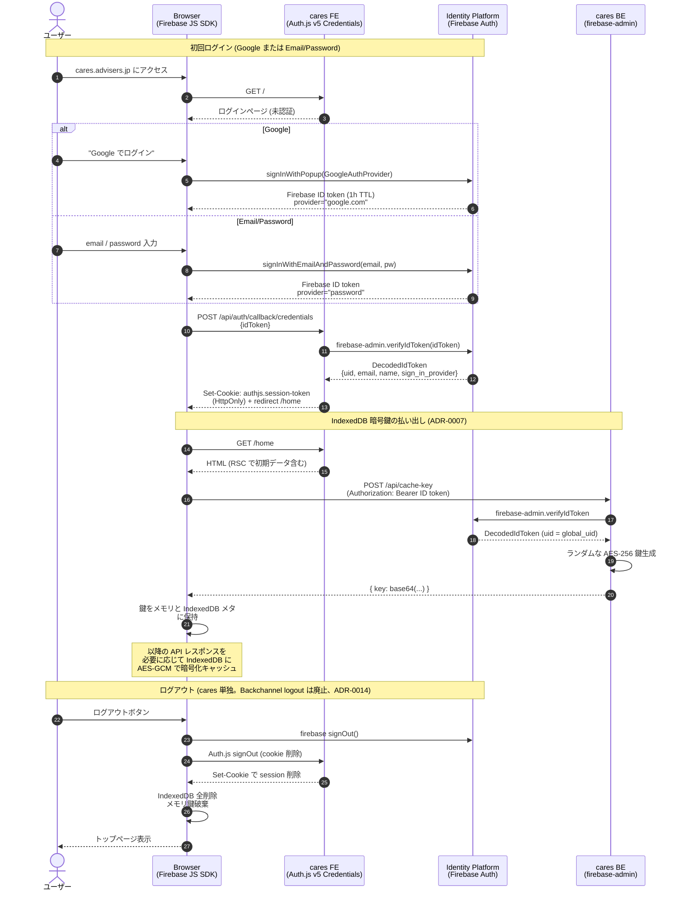

# sequence-auth

```mermaid
%% シーケンス図: ログイン (Identity Platform) + IndexedDB 鍵払い出し
%% ADR-0014, 0007 と整合
%% 現行実装の確定図は ../../architecture/sequence/auth-login.md を参照

sequenceDiagram
    autonumber
    actor U as ユーザー
    participant B as Browser<br/>(Firebase JS SDK)
    participant FE as cares FE<br/>(Auth.js v5 Credentials)
    participant IDP as Identity Platform<br/>(Firebase Auth)
    participant BE as cares BE<br/>(firebase-admin)

    Note over U,IDP: 初回ログイン (Google または Email/Password)
    U->>B: cares.advisers.jp にアクセス
    B->>FE: GET /
    FE-->>B: ログインページ (未認証)
    alt Google
        U->>B: "Google でログイン"
        B->>IDP: signInWithPopup(GoogleAuthProvider)
        IDP-->>B: Firebase ID token (1h TTL)<br/>provider="google.com"
    else Email/Password
        U->>B: email / password 入力
        B->>IDP: signInWithEmailAndPassword(email, pw)
        IDP-->>B: Firebase ID token<br/>provider="password"
    end

    B->>FE: POST /api/auth/callback/credentials<br/>{idToken}
    FE->>IDP: firebase-admin.verifyIdToken(idToken)
    IDP-->>FE: DecodedIdToken<br/>{uid, email, name, sign_in_provider}
    FE-->>B: Set-Cookie: authjs.session-token<br/>(HttpOnly) + redirect /home

    Note over B,BE: IndexedDB 暗号鍵の払い出し (ADR-0007)
    B->>FE: GET /home
    FE-->>B: HTML (RSC で初期データ含む)
    B->>BE: POST /api/cache-key<br/>(Authorization: Bearer ID token)
    BE->>IDP: firebase-admin.verifyIdToken
    IDP-->>BE: DecodedIdToken (uid = global_uid)
    BE->>BE: ランダムな AES-256 鍵生成
    BE-->>B: { key: base64(...) }
    B->>B: 鍵をメモリと IndexedDB メタ<br/>に保持
    Note over B: 以降の API レスポンスを<br/>必要に応じて IndexedDB に<br/>AES-GCM で暗号化キャッシュ

    Note over U,IDP: ログアウト (cares 単独。Backchannel logout は廃止、ADR-0014)
    U->>B: ログアウトボタン
    B->>IDP: firebase signOut()
    B->>FE: Auth.js signOut (cookie 削除)
    FE-->>B: Set-Cookie で session 削除
    B->>B: IndexedDB 全削除<br/>メモリ鍵破棄
    B-->>U: トップページ表示
```
