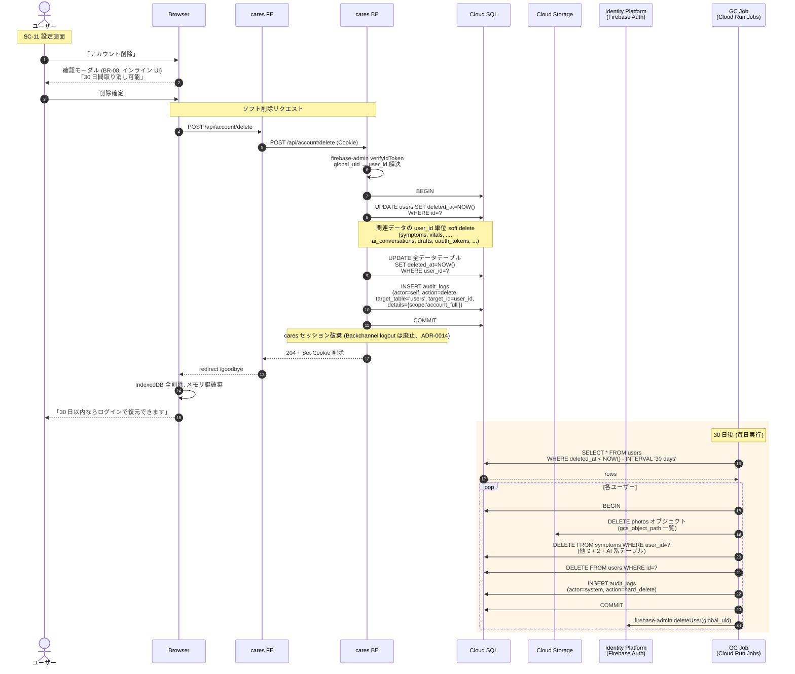

# sequence-deletion-request

```mermaid
%% シーケンス図: アカウント削除リクエスト (ソフト削除 → 30 日後ハード削除)
%% FN-AUTH-07, BR-06/13/21, ADR-0014 と整合 (BR-19 Backchannel logout は ADR-0014 で廃止)

sequenceDiagram
    autonumber
    actor U as ユーザー
    participant B as Browser
    participant FE as cares FE
    participant BE as cares BE
    participant DB as Cloud SQL
    participant Storage as Cloud Storage
    participant IDP as Identity Platform<br/>(Firebase Auth)
    participant GC as GC Job<br/>(Cloud Run Jobs)

    Note over U: SC-11 設定画面
    U->>B: 「アカウント削除」
    B-->>U: 確認モーダル (BR-08, インライン UI)<br/>「30 日間取り消し可能」
    U->>B: 削除確定

    Note over B,BE: ソフト削除リクエスト
    B->>FE: POST /api/account/delete
    FE->>BE: POST /api/account/delete (Cookie)
    BE->>BE: firebase-admin verifyIdToken<br/>global_uid → user_id 解決

    BE->>DB: BEGIN
    BE->>DB: UPDATE users SET deleted_at=NOW()<br/>WHERE id=?
    Note over BE,DB: 関連データの user_id 単位 soft delete<br/>(symptoms, vitals, ...,<br/> ai_conversations, drafts, oauth_tokens, ...)
    BE->>DB: UPDATE 全データテーブル<br/>SET deleted_at=NOW()<br/>WHERE user_id=?
    BE->>DB: INSERT audit_logs<br/>(actor=self, action=delete,<br/> target_table='users', target_id=user_id,<br/> details={scope:'account_full'})
    BE->>DB: COMMIT

    Note over BE: cares セッション破棄 (Backchannel logout は廃止、ADR-0014)
    BE-->>FE: 204 + Set-Cookie 削除
    FE-->>B: redirect /goodbye
    B->>B: IndexedDB 全削除, メモリ鍵破棄
    B-->>U: 「30 日以内ならログインで復元できます」

    rect rgb(255, 245, 230)
    Note over GC: 30 日後 (毎日実行)
    GC->>DB: SELECT * FROM users<br/>WHERE deleted_at < NOW() - INTERVAL '30 days'
    DB-->>GC: rows
    loop 各ユーザー
        GC->>DB: BEGIN
        GC->>Storage: DELETE photos オブジェクト<br/>(gcs_object_path 一覧)
        GC->>DB: DELETE FROM symptoms WHERE user_id=?<br/>(他 9 + 2 + AI 系テーブル)
        GC->>DB: DELETE FROM users WHERE id=?
        GC->>DB: INSERT audit_logs<br/>(actor=system, action=hard_delete)
        GC->>DB: COMMIT
        GC->>IDP: firebase-admin.deleteUser(global_uid)
    end
    end
```
