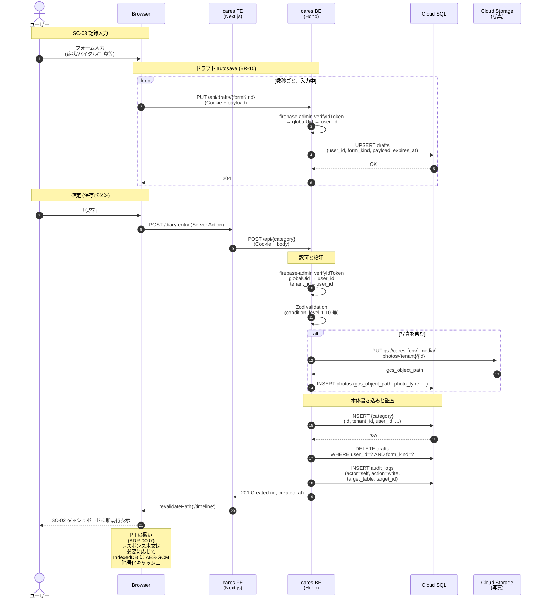

# sequence-diary-post

```mermaid
%% シーケンス図: 日記 (記録) 投稿
%% FN-DIARY-02/03/06, BR-08/10/13/15 と整合

sequenceDiagram
    autonumber
    actor U as ユーザー
    participant B as Browser
    participant FE as cares FE<br/>(Next.js)
    participant BE as cares BE<br/>(Hono)
    participant DB as Cloud SQL
    participant Storage as Cloud Storage<br/>(写真)

    Note over U,B: SC-03 記録入力
    U->>B: フォーム入力<br/>(症状/バイタル/写真等)

    Note over B,BE: ドラフト autosave (BR-15)
    loop 数秒ごと、入力中
        B->>BE: PUT /api/drafts/{formKind}<br/>(Cookie + payload)
        BE->>BE: firebase-admin verifyIdToken<br/>→ globalUid → user_id
        BE->>DB: UPSERT drafts<br/>(user_id, form_kind, payload, expires_at)
        DB-->>BE: OK
        BE-->>B: 204
    end

    Note over U,B: 確定 (保存ボタン)
    U->>B: 「保存」
    B->>FE: POST /diary-entry (Server Action)
    FE->>BE: POST /api/{category}<br/>(Cookie + body)

    Note over BE: 認可と検証
    BE->>BE: firebase-admin verifyIdToken<br/>globalUid → user_id<br/>tenant_id = user_id
    BE->>BE: Zod validation<br/>(condition_level 1-10 等)

    alt 写真を含む
        BE->>Storage: PUT gs://cares-{env}-media/<br/>photos/{tenant}/{id}
        Storage-->>BE: gcs_object_path
        BE->>DB: INSERT photos (gcs_object_path, photo_type, ...)
    end

    Note over BE,DB: 本体書き込みと監査
    BE->>DB: INSERT {category}<br/>(id, tenant_id, user_id, ...)
    DB-->>BE: row
    BE->>DB: DELETE drafts<br/>WHERE user_id=? AND form_kind=?
    BE->>DB: INSERT audit_logs<br/>(actor=self, action=write,<br/> target_table, target_id)

    BE-->>FE: 201 Created (id, created_at)
    FE-->>B: revalidatePath('/timeline')
    B-->>U: SC-02 ダッシュボードに新規行表示

    Note over B: PII の扱い<br/>(ADR-0007)<br/>レスポンス本文は<br/>必要に応じて<br/>IndexedDB に AES-GCM<br/>暗号化キャッシュ
```
