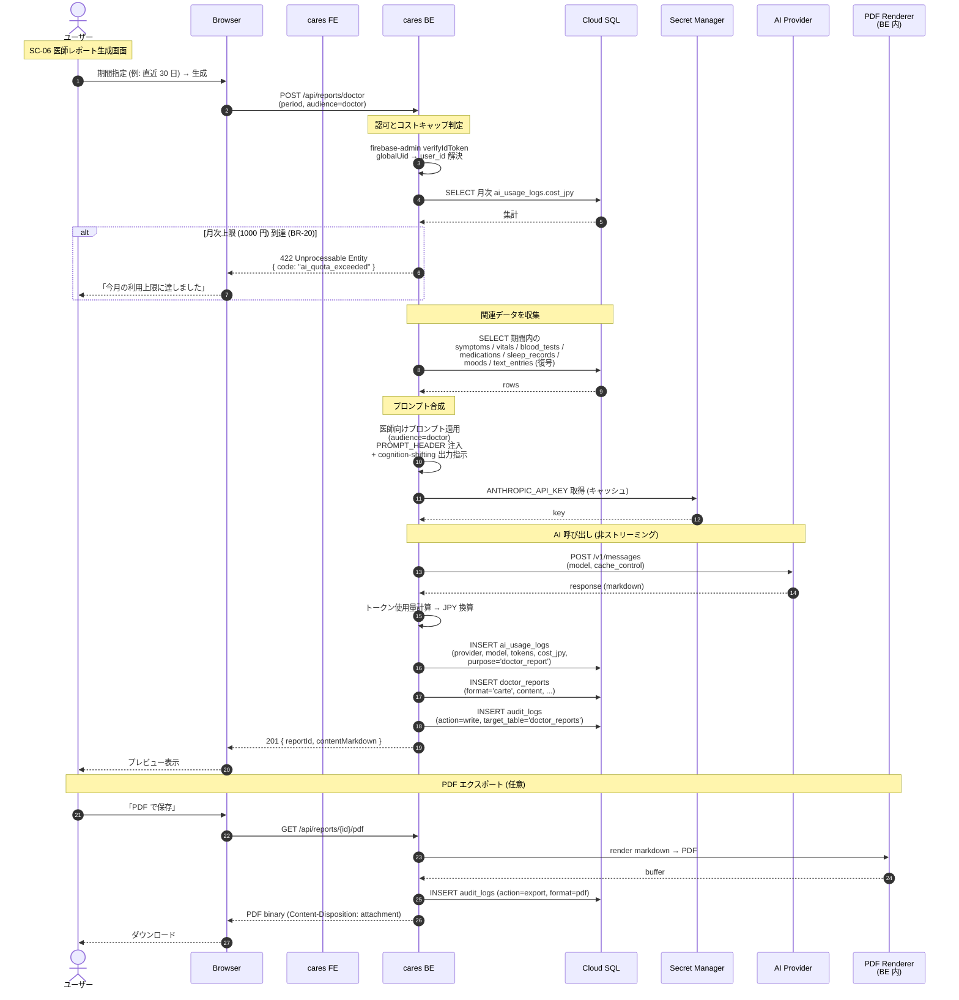

# sequence-doctor-report

```mermaid
%% シーケンス図: 医師提出レポート生成 + PDF エクスポート
%% FN-AI-05 (医師レポート) + FN-INT-05 (エクスポート), BR-09 と整合

sequenceDiagram
    autonumber
    actor U as ユーザー
    participant B as Browser
    participant FE as cares FE
    participant BE as cares BE
    participant DB as Cloud SQL
    participant SM as Secret Manager
    participant AI as AI Provider
    participant PDF as PDF Renderer<br/>(BE 内)

    Note over U: SC-06 医師レポート生成画面
    U->>B: 期間指定 (例: 直近 30 日) → 生成
    B->>BE: POST /api/reports/doctor<br/>(period, audience=doctor)

    Note over BE: 認可とコストキャップ判定
    BE->>BE: firebase-admin verifyIdToken<br/>globalUid → user_id 解決
    BE->>DB: SELECT 月次 ai_usage_logs.cost_jpy
    DB-->>BE: 集計
    alt 月次上限 (1000 円) 到達 (BR-20)
        BE-->>B: 422 Unprocessable Entity<br/>{ code: "ai_quota_exceeded" }
        B-->>U: 「今月の利用上限に達しました」
    end

    Note over BE,DB: 関連データを収集
    BE->>DB: SELECT 期間内の<br/>symptoms / vitals / blood_tests /<br/>medications / sleep_records /<br/>moods / text_entries (復号)
    DB-->>BE: rows

    Note over BE: プロンプト合成
    BE->>BE: 医師向けプロンプト適用<br/>(audience=doctor)<br/>PROMPT_HEADER 注入<br/>+ cognition-shifting 出力指示

    BE->>SM: ANTHROPIC_API_KEY 取得 (キャッシュ)
    SM-->>BE: key

    Note over BE,AI: AI 呼び出し (非ストリーミング)
    BE->>AI: POST /v1/messages<br/>(model, cache_control)
    AI-->>BE: response (markdown)

    BE->>BE: トークン使用量計算 → JPY 換算
    BE->>DB: INSERT ai_usage_logs<br/>(provider, model, tokens, cost_jpy,<br/> purpose='doctor_report')
    BE->>DB: INSERT doctor_reports<br/>(format='carte', content, ...)
    BE->>DB: INSERT audit_logs<br/>(action=write, target_table='doctor_reports')

    BE-->>B: 201 { reportId, contentMarkdown }
    B-->>U: プレビュー表示

    Note over U,PDF: PDF エクスポート (任意)
    U->>B: 「PDF で保存」
    B->>BE: GET /api/reports/{id}/pdf
    BE->>PDF: render markdown → PDF
    PDF-->>BE: buffer
    BE->>DB: INSERT audit_logs (action=export, format=pdf)
    BE-->>B: PDF binary (Content-Disposition: attachment)
    B-->>U: ダウンロード
```
