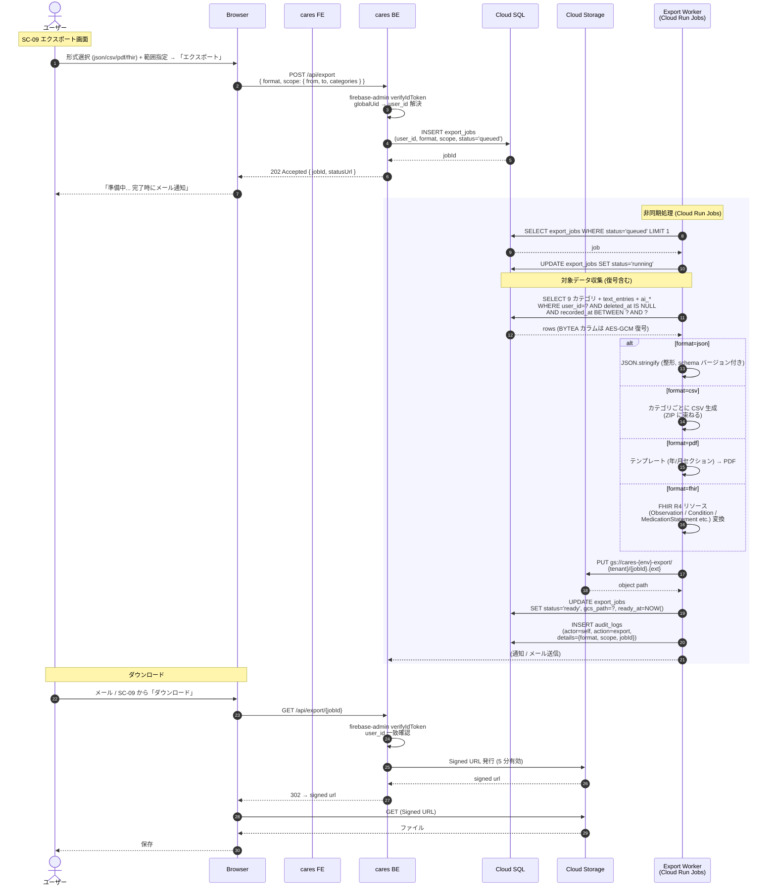

# sequence-export

```mermaid
%% シーケンス図: データエクスポート (JSON/CSV/PDF/FHIR)
%% FN-INT-05, BR-13/18 と整合

sequenceDiagram
    autonumber
    actor U as ユーザー
    participant B as Browser
    participant FE as cares FE
    participant BE as cares BE
    participant DB as Cloud SQL
    participant Storage as Cloud Storage
    participant Job as Export Worker<br/>(Cloud Run Jobs)

    Note over U: SC-09 エクスポート画面
    U->>B: 形式選択 (json/csv/pdf/fhir) + 範囲指定 → 「エクスポート」
    B->>BE: POST /api/export<br/>{ format, scope: { from, to, categories } }

    BE->>BE: firebase-admin verifyIdToken<br/>globalUid → user_id 解決
    BE->>DB: INSERT export_jobs<br/>(user_id, format, scope, status='queued')
    DB-->>BE: jobId
    BE-->>B: 202 Accepted { jobId, statusUrl }
    B-->>U: 「準備中... 完了時にメール通知」

    rect rgb(245, 245, 255)
    Note over Job: 非同期処理 (Cloud Run Jobs)
    Job->>DB: SELECT export_jobs WHERE status='queued' LIMIT 1
    DB-->>Job: job
    Job->>DB: UPDATE export_jobs SET status='running'

    Note over Job,DB: 対象データ収集 (復号含む)
    Job->>DB: SELECT 9 カテゴリ + text_entries + ai_*<br/>WHERE user_id=? AND deleted_at IS NULL<br/>AND recorded_at BETWEEN ? AND ?
    DB-->>Job: rows (BYTEA カラムは AES-GCM 復号)

    alt format=json
        Job->>Job: JSON.stringify (整形, schema バージョン付き)
    else format=csv
        Job->>Job: カテゴリごとに CSV 生成<br/>(ZIP に束ねる)
    else format=pdf
        Job->>Job: テンプレート (年/月セクション) → PDF
    else format=fhir
        Job->>Job: FHIR R4 リソース<br/>(Observation / Condition /<br/>MedicationStatement etc.) 変換
    end

    Job->>Storage: PUT gs://cares-{env}-export/<br/>{tenant}/{jobId}.{ext}
    Storage-->>Job: object path
    Job->>DB: UPDATE export_jobs<br/>SET status='ready', gcs_path=?, ready_at=NOW()
    Job->>DB: INSERT audit_logs<br/>(actor=self, action=export,<br/> details={format, scope, jobId})
    Job-->>BE: (通知 / メール送信)
    end

    Note over U,B: ダウンロード
    U->>B: メール / SC-09 から「ダウンロード」
    B->>BE: GET /api/export/{jobId}
    BE->>BE: firebase-admin verifyIdToken<br/>user_id 一致確認
    BE->>Storage: Signed URL 発行 (5 分有効)
    Storage-->>BE: signed url
    BE-->>B: 302 → signed url
    B->>Storage: GET (Signed URL)
    Storage-->>B: ファイル
    B-->>U: 保存
```
