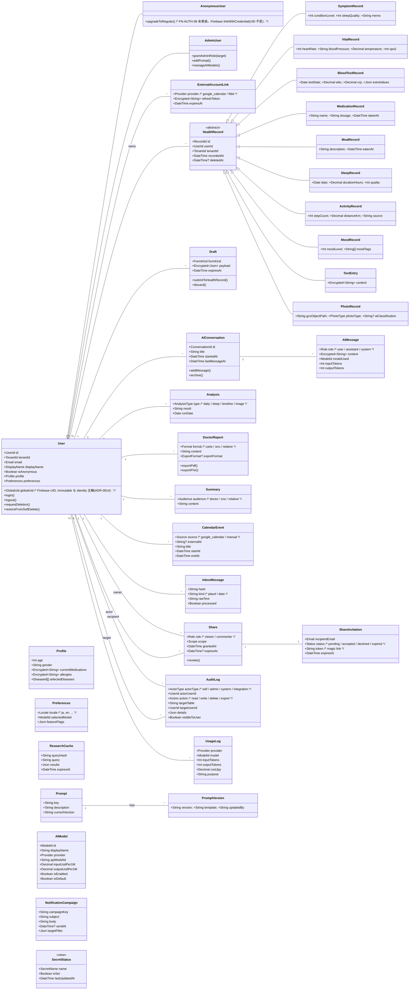

# data-model

```mermaid
%% ドメインクラス図 (Mermaid)
%% ER 図 (er/er.md) より抽象度を上げ、ドメイン概念を主役にした図
%% 暗号化や監査の技術詳細はここでは省く

classDiagram
    direction LR

    %% ==================== Identity ====================
    class User {
        +UserId id
        +TenantId tenantId
        +GlobalUid globalUid  /* Firebase UID, immutable な identity 主軸 (ADR-0014) */
        +Email email
        +DisplayName displayName
        +Boolean isAnonymous
        +Profile profile
        +Preferences preferences
        +login()
        +logout()
        +requestDeletion()
        +restoreFromSoftDelete()
    }

    class AnonymousUser {
        +upgradeToRegular()  /* FN-AUTH-08 未実装。Firebase linkWithCredential (UID 不変) */
    }
    User <|-- AnonymousUser

    class AdminUser {
        +grantAdminRole(target)
        +editPrompt()
        +manageAIModels()
    }
    User <|-- AdminUser

    class Profile {
        +Int age
        +String gender
        +Encrypted~String~ currentMedications
        +Encrypted~String~ allergies
        +DiseaseId[] selectedDiseases
    }

    class Preferences {
        +Locale locale  /* ja, en, ... */
        +ModelId selectedModel
        +Json featureFlags
    }

    class ExternalAccountLink {
        +Provider provider  /* google_calendar / fitbit */
        +Encrypted~String~ refreshToken
        +DateTime expiresAt
    }
    User "1" -- "*" ExternalAccountLink

    %% ==================== Diary ====================
    class HealthRecord {
        <<abstract>>
        +RecordId id
        +UserId userId
        +TenantId tenantId
        +DateTime recordedAt
        +DateTime? deletedAt
    }

    class SymptomRecord { +Int conditionLevel; +Int sleepQuality; +String memo }
    class VitalRecord { +Int heartRate; +String bloodPressure; +Decimal temperature; +Int spo2 }
    class BloodTestRecord { +Date testDate; +Decimal wbc; +Decimal crp; +Json extraValues }
    class MedicationRecord { +String name; +String dosage; +DateTime takenAt }
    class MealRecord { +String description; +DateTime eatenAt }
    class SleepRecord { +Date date; +Decimal durationHours; +Int quality }
    class ActivityRecord { +Int stepCount; +Decimal distanceKm; +String source }
    class MoodRecord { +Int moodLevel; +String[] moodTags }
    class TextEntry { +Encrypted~String~ content }
    class PhotoRecord { +String gcsObjectPath; +PhotoType photoType; +String? aiClassification }

    HealthRecord <|-- SymptomRecord
    HealthRecord <|-- VitalRecord
    HealthRecord <|-- BloodTestRecord
    HealthRecord <|-- MedicationRecord
    HealthRecord <|-- MealRecord
    HealthRecord <|-- SleepRecord
    HealthRecord <|-- ActivityRecord
    HealthRecord <|-- MoodRecord
    HealthRecord <|-- TextEntry
    HealthRecord <|-- PhotoRecord

    User "1" -- "*" HealthRecord : owns

    class Draft {
        +FormKind formKind
        +Encrypted~Json~ payload
        +DateTime expiresAt
        +submitToHealthRecord()
        +discard()
    }
    User "1" -- "*" Draft

    %% ==================== AI ====================
    class AIConversation {
        +ConversationId id
        +String title
        +DateTime startedAt
        +DateTime lastMessageAt
        +addMessage()
        +archive()
    }
    User "1" -- "*" AIConversation

    class AIMessage {
        +Role role  /* user / assistant / system */
        +Encrypted~String~ content
        +ModelId modelUsed
        +Int inputTokens
        +Int outputTokens
    }
    AIConversation "1" -- "*" AIMessage

    class Analysis {
        +AnalysisType type  /* daily / deep / timeline / image */
        +String result
        +Date runDate
    }
    User "1" -- "*" Analysis

    class DoctorReport {
        +Format format  /* carte / sns / relative */
        +String content
        +ExportFormat? exportFormat
        +exportPdf()
        +exportFhir()
    }
    User "1" -- "*" DoctorReport

    class Summary {
        +Audience audience  /* doctor / sns / relative */
        +String content
    }
    User "1" -- "*" Summary

    %% ==================== Integration ====================
    class CalendarEvent {
        +Source source  /* google_calendar / manual */
        +String? externalId
        +String title
        +DateTime startAt
        +DateTime endAt
    }
    User "1" -- "*" CalendarEvent

    class InboxMessage {
        +String hash
        +String kind  /* plaud / data */
        +String rawText
        +Boolean processed
    }
    User "1" -- "*" InboxMessage

    class ResearchCache {
        +String queryHash
        +String query
        +Json results
        +DateTime expiresAt
    }

    %% ==================== Sharing (Phase 5 後半) ====================
    class Share {
        +Role role  /* viewer / commenter */
        +Scope scope
        +DateTime grantedAt
        +DateTime? expiresAt
        +revoke()
    }
    User "1" -- "*" Share : owner
    User "1" -- "*" Share : recipient

    class ShareInvitation {
        +Email recipientEmail
        +Status status  /* pending / accepted / declined / expired */
        +String token  /* magic link */
        +DateTime expiresAt
    }
    Share "1" -- "1" ShareInvitation

    %% ==================== Admin ====================
    class Prompt {
        +String key
        +String description
        +String currentVersion
    }
    class PromptVersion { +String version; +String template; +String updatedBy }
    Prompt "1" -- "*" PromptVersion : has

    class AIModel {
        +ModelId id
        +String displayName
        +Provider provider
        +String apiModelId
        +Decimal inputUsdPer1M
        +Decimal outputUsdPer1M
        +Boolean isEnabled
        +Boolean isDefault
    }

    class NotificationCampaign {
        +String campaignKey
        +String subject
        +String body
        +DateTime? sendAt
        +Json targetFilter
    }

    class SecretStatus {
        <<view>>
        +SecretName name
        +Boolean isSet
        +DateTime lastUpdatedAt
    }

    %% ==================== Audit / Usage ====================
    class AuditLog {
        +ActorType actorType  /* self / admin / system / integration */
        +UserId actorUserId
        +Action action  /* read / write / delete / export */
        +String targetTable
        +UserId targetUserId
        +Json details
        +Boolean visibleToUser
    }
    User "1" -- "*" AuditLog : actor
    User "1" -- "*" AuditLog : target

    class UsageLog {
        +Provider provider
        +ModelId model
        +Int inputTokens
        +Int outputTokens
        +Decimal costJpy
        +String purpose
    }
    User "1" -- "*" UsageLog
```
