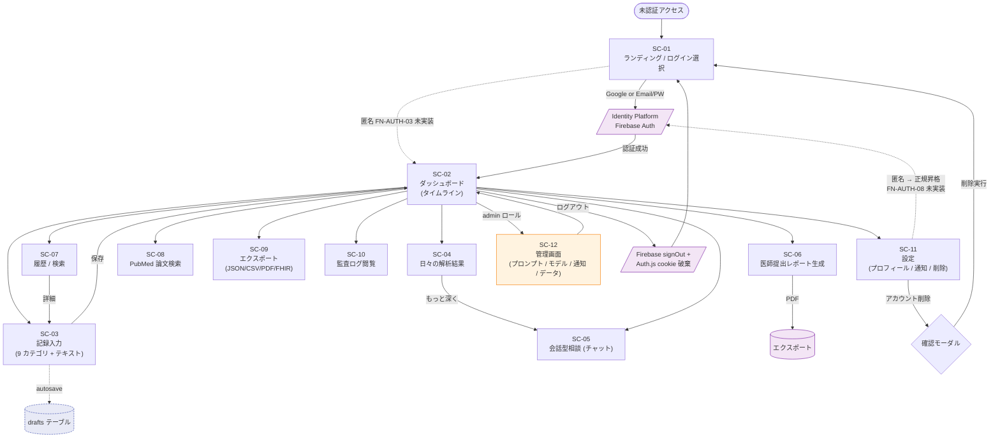

# screen-flow

```mermaid
%% 画面遷移図: cares 主要画面
%% 画面 ID SC-NN の体系は要件定義書 §6 で定義済み
%% 詳細ワイヤは ../../design-system/screens/sc-XX-*.md を参照

flowchart TD
    Start([未認証アクセス]) --> SC01

    SC01["SC-01<br/>ランディング / ログイン選択"]
    SC01 -->|Google or Email/PW| IDP[/Identity Platform<br/>Firebase Auth/]
    SC01 -.->|匿名 FN-AUTH-03 未実装| SC02
    IDP -->|認証成功| SC02

    SC02["SC-02<br/>ダッシュボード<br/>(タイムライン)"]

    %% 記録系
    SC02 --> SC03["SC-03<br/>記録入力<br/>(9 カテゴリ + テキスト)"]
    SC03 -->|保存| SC02
    SC03 -.->|autosave| Draft[(drafts テーブル)]

    %% AI 系
    SC02 --> SC04["SC-04<br/>日々の解析結果"]
    SC04 -->|もっと深く| SC05
    SC02 --> SC05["SC-05<br/>会話型相談 (チャット)"]
    SC02 --> SC06["SC-06<br/>医師提出レポート生成"]
    SC06 -->|PDF| Export[(エクスポート)]

    %% 履歴・調査
    SC02 --> SC07["SC-07<br/>履歴 / 検索"]
    SC07 -->|詳細| SC03
    SC02 --> SC08["SC-08<br/>PubMed 論文検索"]

    %% アカウント関連
    SC02 --> SC09["SC-09<br/>エクスポート<br/>(JSON/CSV/PDF/FHIR)"]
    SC02 --> SC10["SC-10<br/>監査ログ閲覧"]
    SC02 --> SC11["SC-11<br/>設定<br/>(プロフィール / 通知 / 削除)"]
    SC11 -->|アカウント削除| Conf{確認モーダル}
    Conf -->|削除実行| SC01
    SC11 -.->|匿名 → 正規昇格<br/>FN-AUTH-08 未実装| IDP

    %% 管理画面
    SC02 -->|admin ロール| SC12["SC-12<br/>管理画面<br/>(プロンプト / モデル / 通知 / データ)"]
    SC12 --> SC02

    %% ログアウト (cares 単独。Backchannel logout は廃止、ADR-0014)
    SC02 -->|ログアウト| Logout[/Firebase signOut +<br/>Auth.js cookie 破棄/]
    Logout --> SC01

    classDef admin fill:#fff3e0,stroke:#f57c00
    classDef external fill:#f3e5f5,stroke:#7b1fa2
    classDef store fill:#e8eaf6,stroke:#3949ab,stroke-dasharray: 4 2

    class SC12 admin
    class IDP,Logout,Export external
    class Draft store
```
