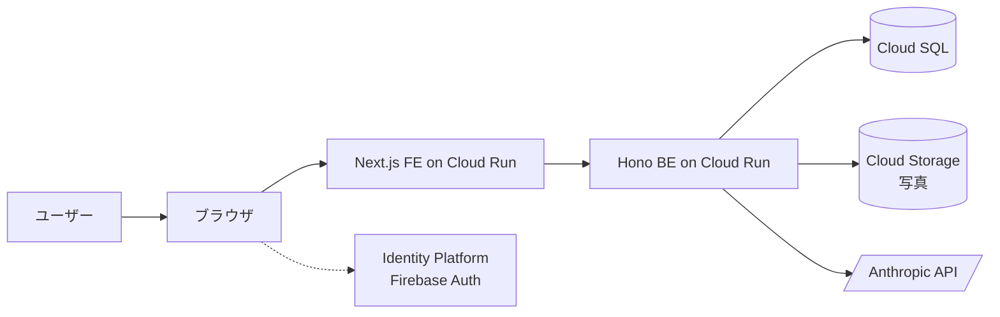

# 基本設計書 v2（健康日記 / cares）

新仕様 cares の **どう作るか（全体像・方式）** を示す上位文書。詳細は ADR と詳細設計書を参照する。

- 対象システム: 健康日記（旧名: 未病ダイアリー）の GCP 全面リアーキテクチャ版
- 旧仕様参照: [`docs_restruct/basic-design/基本設計書.md`](https://github.com/agewaller/stock-screener/blob/main/docs_restruct/basic-design/基本設計書.md)
- ADR 索引: [`../adr/README.md`](../adr/README.md)
- 要件定義書 v2: 作成予定（フェーズ 3）。当面はインタビュー記録 [`../requirements/interview-log.md`](../requirements/interview-log.md) を参照

> **2026-05-26 改訂**: 認証基盤を Keycloak セルフホスト ([ADR-0002](../adr/0002-sso-lv2-with-keycloak.md)) から **GCP Identity Platform (Firebase Auth)** ([ADR-0014](../adr/0014-auth-switch-to-identity-platform.md)) に切替。本文・配下の図 (architecture/ er/ screen-flow/ data-model/) の Keycloak 記述は Firebase に修正済。Identity Platform 連携の詳細フロー図は [`../architecture/system-overview.md`](../architecture/system-overview.md) と [`../architecture/sequence/auth-login.md`](../architecture/sequence/auth-login.md) を参照。

## 1. 全体構成

ユーザーはブラウザから cares.advisers.jp にアクセスし、**GCP Identity Platform (Firebase Auth)** でログインし、cares 本体の機能を利用する。



詳細図は [`architecture/component.md`](architecture/component.md) と [`architecture/deployment.md`](architecture/deployment.md) を参照。

## 2. 技術スタック

| レイヤ | 技術 | 採用 ADR |
|---|---|---|
| フロントエンド | TypeScript + Next.js (App Router) + Tailwind + shadcn/ui + PWA | [ADR-0003](../adr/0003-frontend-stack-nextjs.md) |
| バックエンド | TypeScript + Hono + Prisma + REST/OpenAPI/Zod | [ADR-0004](../adr/0004-backend-stack-typescript-hono-prisma.md) |
| 認証 | GCP Identity Platform (Firebase Auth) + Auth.js v5 Credentials provider | [ADR-0014](../adr/0014-auth-switch-to-identity-platform.md) |
| DB | Cloud SQL for PostgreSQL | [ADR-0005](../adr/0005-gcp-services-and-environments.md) |
| ホスティング | Cloud Run（asia-northeast1） | [ADR-0005](../adr/0005-gcp-services-and-environments.md) |
| ストレージ | Cloud Storage | [ADR-0005](../adr/0005-gcp-services-and-environments.md) |
| シークレット | Secret Manager | [ADR-0005](../adr/0005-gcp-services-and-environments.md), [ADR-0006](../adr/0006-ai-provider-strategy.md) |
| AI | Anthropic / OpenAI / Gemini（サーバ専有鍵） | [ADR-0006](../adr/0006-ai-provider-strategy.md) |
| 監視 | Cloud Logging + Cloud Monitoring | [ADR-0005](../adr/0005-gcp-services-and-environments.md) |
| IaC | Terraform | [ADR-0005](../adr/0005-gcp-services-and-environments.md) |
| CI/CD | GitHub Actions | [ADR-0005](../adr/0005-gcp-services-and-environments.md) |

## 3. システム境界

```
┌─────────────────────────────────────────────────────────┐
│  cares (このリポジトリのスコープ)                          │
│  ┌─────────────┐  ┌──────────┐  ┌────────────┐         │
│  │ Next.js FE  │→ │ Hono BE  │→ │ Cloud SQL  │         │
│  └─────────────┘  └──────────┘  └────────────┘         │
└─────────────────────────────────────────────────────────┘
         ↑                  ↓                  ↓
┌────────────────────┐   ┌──────────────┐   ┌──────────────┐
│ GCP Identity       │   │ AI Provider  │   │ Google       │
│ Platform (Firebase │   │ Anthropic    │   │ Calendar etc │
│  Auth)             │   │ (Claude)     │   └──────────────┘
└────────────────────┘   └──────────────┘
```

- cares の責任範囲: ユーザー向け Web 画面、ユーザーデータ管理、AI 呼び出し、外部連携の orchestration
- cares の責任外: 認証（Identity Platform）、AI 推論（Anthropic）、メール送信（Identity Platform 標準 / SendGrid 等）

## 4. データフロー概要

### 4.1 認証フロー (Identity Platform / ADR-0014)

ユーザーがログインボタンを押すと、ブラウザ側の Firebase JS SDK が **Google sign-in (popup)** または **email/password** で Identity Platform に認証 → Firebase ID token を取得。これを Auth.js v5 の Credentials provider に POST → BE で firebase-admin の `verifyIdToken` → HttpOnly Cookie (`authjs.session-token`) でセッション確立。

OWNER (agewaller@gmail.com) は `provider === "password"` のときだけ admin。Google ログインでは一般ユーザ扱い (Gmail 乗っ取り対策、ADR-0011 改訂 Tier 2)。

→ 詳細: [`../architecture/sequence/auth-login.md`](../architecture/sequence/auth-login.md)

### 4.2 AI 呼び出しフロー（ストリーミング）

ブラウザからの AI 質問は BE で受け取り、Secret Manager から鍵取得 → Anthropic 等にストリーミング呼び出し → SSE で BE → FE → Browser に転送。完了後、トークン使用量をログに記録、コストキャップを更新。

→ 詳細: [`architecture/sequence-ai.md`](architecture/sequence-ai.md)

### 4.3 データ書き込みフロー

ブラウザからの POST → FE (Server Action or Route Handler) で軽い検証 → BE の REST API → Zod でバリデーション → Prisma で Cloud SQL に書き込み → 監査ログ記録 → クライアントへ結果返却。ブラウザ側 IndexedDB は暗号化キャッシュとして用途別に最小限利用。

## 5. ID とテナント設計

### 5.1 ユーザー ID

- **global_uid**: Firebase Auth (Identity Platform) が発行する immutable な UID (旧設計の Keycloak `sub` 相当)
- `users` テーブルに `global_uid` を直接 unique カラムとして保管 (旧設計の `user_link` テーブルは ADR-0014 で廃止)
- アプリ内 FK は `users.id` (UUID) を使う。`global_uid` は認可境界の入口でのみ参照

### 5.2 テナント ID

- 全ユーザーデータテーブルに `tenant_id` を含める
- MVP では `tenant_id = users.local_user_id`（個人テナント）
- 将来 B2B 化時に組織を表す tenant_id にユーザーをぶら下げる

→ 詳細: [ADR-0008](../adr/0008-multi-tenant-ready-schema.md), ER 図 [`er/`](er/) （フェーズ 3 で作成）

## 6. セキュリティ方針

### 6.1 データ保管

- 個人情報は Cloud SQL（東京リージョン、Private IP）に集約
- 写真・添付は Cloud Storage（暗号化保管）
- バックアップは PITR + 30 日保持

### 6.2 鍵管理

- すべての API 鍵・秘密値は Secret Manager
- ブラウザに鍵を渡さない（旧仕様継続）
- AI Provider 鍵は BE が Workload Identity で取得

### 6.3 ブラウザストレージ

- **localStorage / sessionStorage**: PII 完全禁止
- **IndexedDB**: 暗号化（AES-GCM）して一時キャッシュとしてのみ許容、セッション中限定
- **Cookie**: HttpOnly + Secure + SameSite=Strict のセッションのみ

→ 詳細: [ADR-0007](../adr/0007-browser-pii-prohibition.md)

### 6.4 認可ガード

- 全 API は Firebase ID token を `firebase-admin` の `verifyIdToken` で検証 (ADR-0014)
- 管理 API は 3 段フェイルセーフ ([ADR-0011](../adr/0011-admin-model-with-failsafe.md) 改訂):
  1. Firebase Custom Claim `admin: true` (`grant-admin.ts` で付与)
  2. OWNER_EMAIL AND `provider === "password"` (Google ログインでは admin にならない)
  3. `x-admin-token` (CLI break-glass、ADR-0014 で実装)

→ 詳細: [ADR-0011](../adr/0011-admin-model-with-failsafe.md)

### 6.5 監査ログ

- すべてのデータアクセス（read / write / delete / export）を `audit_logs` テーブルに記録
- ユーザー本人にも公開（誰がいつアクセスしたか確認できる UI）
- Cloud Audit Logs と併用

## 7. 環境戦略

> **実装状況 (2026-06-01、フェーズ 6 最小構成)**: 現在は**単一 GCP プロジェクト** `arctic-anvil-497002-q2` に prod 相当（Cloud Run `cares-api`/`cares-web` + Cloud SQL）を構築済み。
> URL も Cloud Run 既定の `*.run.app` を使用（カスタムドメイン未設定）。dev はローカル Docker Compose。
> 下表の 3 環境 × プロジェクト分離は**目標構成（フェーズ 7 以降）**。`identity-*` プロジェクトは ADR-0014 で不要になった。
> 現状の実構成は [`../architecture/system-overview.md`](../architecture/system-overview.md) と [`../OPERATIONS.md`](../OPERATIONS.md) §7 が正本。

| 環境 | GCP プロジェクト | URL |
|---|---|---|
| prod | cares-prod | cares.advisers.jp |
| staging | cares-staging | staging.cares.advisers.jp |
| dev | cares-dev | dev.cares.advisers.jp |
| shared | shared | （Artifact Registry / 集約監視） |

→ 詳細: [ADR-0005](../adr/0005-gcp-services-and-environments.md), [`architecture/deployment.md`](architecture/deployment.md)

## 8. デプロイ・運用方針

### 8.1 デプロイ

> **実装状況 (2026-06-01)**: 現在の CI (GitHub Actions) は**テストのみ**（ユニット + 結合）。デプロイは [`infra/scripts/`](../../infra/scripts/README.md) の gcloud bash スクリプトを**手動実行**（手順は [`../OPERATIONS.md`](../OPERATIONS.md) §7 / リポジトリ CLAUDE.md の 2 ゲート承認フロー）。
> 以下の自動デプロイ + Terraform は**目標構成（フェーズ 7 以降）**。

- GitHub Actions で main へのマージ → Artifact Registry にイメージ push → Cloud Run へデプロイ
- staging を経て prod へ手動承認で昇格
- Terraform でインフラを管理、Pull Request レビュー必須

### 8.2 監視・アラート

> **実装状況 (2026-06-01)**: Cloud Logging（Cloud Run 標準）と DB の `audit_logs` は稼働中。Cloud Monitoring のアラートポリシー / Slack 通知 / OpenTelemetry trace は未設定（フェーズ 7 以降）。

- Cloud Monitoring でレイテンシ・エラー率・ヘルスチェックを監視
- 重大エラーは Slack / メール通知
- Cloud Logging で構造化ログ
- アプリ層では監査ログを `audit_logs` に保存（DB）

### 8.3 バックアップ・DR

- Cloud SQL 自動バックアップ + PITR 30 日保持
- DR テストは半年に 1 回 PITR からの復元演習

→ 詳細: [ADR-0012](../adr/0012-nfr-baseline.md)

## 9. リポジトリ構造（想定）

```
agewaller/cares (GitHub)
├─ apps/
│  ├─ web/         # Next.js FE (Cloud Run)
│  ├─ api/         # Hono BE (Cloud Run)
│  └─ migration/   # データ移行スクリプト
├─ packages/
│  ├─ shared/      # 共有 Zod スキーマ・型定義
│  └─ db/          # Prisma schema + client
├─ infra/
│  ├─ terraform/   # GCP インフラ定義
│  └─ gcs.md       # Cloud Storage bucket セットアップ + IAM / CORS / Lifecycle (写真機能)
├─ docs/           # docs_cares/ をここに移植
└─ .github/
   └─ workflows/   # CI/CD
```

## 10. 関連ドキュメント

- [ADR 一覧](../adr/README.md)
- [インタビュー記録 / 要件定義の暫定](../requirements/interview-log.md)
- [コンポーネント図](architecture/component.md)
- [デプロイ構成図](architecture/deployment.md)
- [認証シーケンス](architecture/sequence-auth.md)
- [AI 呼び出しシーケンス](architecture/sequence-ai.md)

## 11. 外部連携・データ移行

外部連携の移植優先度と方針は [ADR-0009](../adr/0009-integration-porting-priorities.md)。MVP 必須は Google Calendar / CSV エクスポート / 専門家メール送信 / Plaud、フェーズ 5 後半に Fitbit / Apple Health / CSV インポート。

旧仕様からの移行は [ADR-0010](../adr/0010-data-migration-strategy.md)。データ・アカウントとも自動移行、cares.advisers.jp ドメイン継続、旧システムは `legacy.cares.advisers.jp` として 90 日間並走。

## 12. 完成した補助ドキュメント

- [要件定義書 v2](../requirements/要件定義書.md) — 12 論点を反映した正式版
- [ER 図](er/er.md) と [DB スキーマ詳細](er/schema.md)
- [API 一覧](../detail-design/api/api-list.md) と [OpenAPI 仕様](../detail-design/api/openapi.yaml)
- [詳細設計書 v2](../detail-design/詳細設計書.md) — 認証/暗号化/監査/コスト管理/Identity Platform セットアップ/テスト/デプロイ等

## 13. 残作業

- 画面一覧（SC-NN）の整理（フェーズ 3 後半 or フェーズ 4 着手時）
- B2B 拡張時の追加設計（将来）
- 家族・医師共有機能の詳細 UX（MVP 後）
