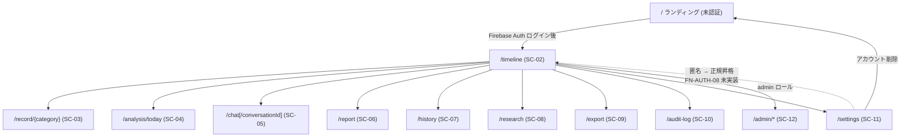

# Information Architecture (情報設計)

cares のサイト構造・URL 設計・ナビゲーション体系。

## サイトマップ



## URL 一覧

> **実装状況 (2026-06-01)**: 「実装」列 ✅ = `apps/web/app/` に実在 / ❌ = 設計のみ・未実装。

| パス | 画面ID | 認証 | 実装 | 説明 |
|---|---|---|---|---|
| `/` | SC-01 | 不要 | ✅ | ランディング / ログイン選択 (認証済みなら `/timeline` へ自動 redirect) |
| `/api/auth/callback/credentials` | — | — | ✅ | Auth.js v5 Credentials provider のコールバック（Firebase ID token を受領、ADR-0014）。リダイレクト型 OIDC callback は廃止 |
| `/timeline` | SC-02 | 必要 | ✅ | ダッシュボード (タイムライン)。**日次解析 / 深堀解析のカード表示 (SC-04 相当) もここに統合実装** |
| `/record/{category}` | SC-03 | 必要 | ✅ | 9 カテゴリ + テキスト記録入力 |
| `/record/{category}/{id}/edit` | SC-03 | 必要 | ✅ | 既存レコード編集（実装は `/edit` サフィックス付き） |
| `/trash` | — | 必要 | ✅ | ごみ箱（ソフト削除済みレコードの一覧・復元。FN-DIARY-05） |
| `/analysis/today` | SC-04 | 必要 | ❌ | 日々の解析結果 (FN-AI-01) の専用ページ。**現状はタイムラインのカード表示で代替** |
| `/analysis/deep/{date}` | SC-04 | 必要 | ❌ | 深堀解析結果 (FN-AI-02) の専用ページ。同上 |
| `/chat` `/chat/{conversationId}` `/chat/new` | SC-05 | 必要 | ❌ | 会話型相談 (FN-AI-03)。**未実装** |
| `/report` | SC-06 | 必要 | ✅ | 医師レポート生成・一覧（`/report/new` で生成） |
| `/report/{id}` | SC-06 | 必要 | ✅ | 個別レポート閲覧 |
| `/history` | SC-07 | 必要 | ❌ | 履歴・検索。**未実装**（タイムラインで代替） |
| `/research` | SC-08 | 必要 | ✅ | PubMed 検索 (FN-RES-01) |
| `/export` | SC-09 | 必要 | ✅ | データエクスポート (FN-INT-05、JSON のみ) |
| `/audit-log` | SC-10 | 必要 | ✅ | 監査ログ閲覧 (FN-AUDIT-01) |
| `/settings` | SC-11 | 必要 | ✅ | 設定（疾患選択 / モデル選択 / locale。プロフィール編集は未実装） |
| `/admin` | SC-12 | admin | ✅ | 管理画面トップ |
| `/admin/prompts` `/admin/keys` `/admin/ai-models` `/admin/notifications` `/admin/users` `/admin/data` | SC-12 | admin | ✅ | 各管理タブ（設計時の `/admin/models` は `/admin/ai-models`、`/admin/system` は未実装） |
| `/goodbye` | — | 不要 | ❌ | アカウント削除完了後の画面。**未実装**（FN-AUTH-07 と合わせて実装予定） |
| `/terms` `/privacy` | — | 不要 | ❌ | 利用規約 / プライバシー (静的)。**未実装** |
| `/api/*` | — | API ごと | ✅ | Hono BE。仕様は [OpenAPI](../detail-design/api/openapi.yaml) / [api-list](../detail-design/api/api-list.md) を参照 |

## ナビゲーション体系

### モバイル底部ナビゲーション (認証後、全画面共通)

```
┌──────────────────────────────────────────────────┐
│ 🏠 ホーム  📅 履歴  ＋ 記録  💬 相談  ⚙ 設定        │
└──────────────────────────────────────────────────┘
```

| 要素 | リンク | 補足 |
|---|---|---|
| 🏠 ホーム | `/timeline` | アクティブ画面ならハイライト |
| 📅 履歴 | `/history` | **未実装**（ページが無いため現状ナビには出さない） |
| ＋ 記録 | `/record/symptom` (デフォルト) | 中央、最も目立つ |
| 💬 相談 | `/chat` | **未実装**（FN-AI-03 実装時に追加） |
| ⚙ 設定 | `/settings` | |

### グローバルヘッダー (認証後)

```
┌──────────────────────────────────────────────────────┐
│ cares                   みち子さん  [≡ メニュー]        │
└──────────────────────────────────────────────────────┘
```

| 要素 | 内容 |
|---|---|
| ロゴ (cares) | クリックで `/timeline` |
| 表示名 | プロフィール表示名 (`/settings` 縮小リンク) |
| ≡ メニュー | 折り畳み: `/report` / `/research` / `/export` / `/audit-log` / `/settings` / ログアウト / (admin の場合は) `/admin` |

### フッター

| 要素 | リンク | 表示 |
|---|---|---|
| 利用規約 | `/terms` | 小さく |
| プライバシーポリシー | `/privacy` | 小さく |
| バージョン | (なし) | 小さく右端 |

### ランディング (未認証時)

ヘッダーは簡素にロゴ + 言語切替のみ。CTA は SC-01 の中央に集約 ([sc-01-login.md](screens/sc-01-login.md) 参照)。

## 認証ガード (Next.js Middleware)

| パス | 未認証アクセス時 |
|---|---|
| `/`, `/oidc/callback`, `/terms`, `/privacy`, `/goodbye` | そのまま表示 |
| 上記以外 | `/?next=<元のパス>` に redirect、ログイン後に復帰 |

| パス | 認証済 + 非 admin |
|---|---|
| `/admin/*` | `/timeline` に redirect + トースト「権限がありません」 |
| 上記以外 | 通常表示 |

### admin 判定 (BR-07, ADR-0011 三段フェイルセーフ)

1. Firebase ID token の Custom Claim `admin: true`
2. OR email == OWNER_EMAIL (環境変数) AND `firebase.sign_in_provider === "password"` (ADR-0011 改訂 / ADR-0014)
3. OR HTTP ヘッダ `x-admin-token` がブレークグラストークンと一致 (緊急時のみ)

いずれか 1 つで通る。Next.js Middleware は (1)/(2) を判定し、(3) は BE 側 (Hono) で API 単位で確認。

## ブラウザタイトル規約

`{画面名} — cares` 形式で統一。

- 例: `ダッシュボード — cares` / `2026-05-27 の症状 — cares` / `相談「頭痛について」 — cares`

PII を含む画面 (`/timeline`, `/history`, `/audit-log` 等) のタイトルにユーザーの名前等は入れない。

## breadcrumb (パンくず)

MVP では原則採用しない (階層浅め + モバイル底部ナビで代替)。`/admin/*` のみ、各管理タブから admin トップに戻れるよう breadcrumb を 1 段だけ置く。

## URL の不変性 (リンク先約束)

- `/report/{id}`, `/chat/{conversationId}`, `/record/{category}/{id}` の `{id}` は UUID (`uuid v4`)。表示用 ID として 8 文字短縮しない (auditability のため URL に full UUID)
- 日付パラメタは `YYYY-MM-DD` (JST)、`/diary/2026-05-27` 等
- カテゴリ名は不変。リネームしない (リダイレクト維持が困難)

## Cache-Control 規約

- `/api/*` のうち PII を返すもの: `Cache-Control: no-store` (BR-16)
- ページ HTML のうち PII を含むレスポンス (`/timeline`, `/record/...`, `/chat/...`, `/audit-log`, ...): `Cache-Control: no-store`
- 静的アセット (`/_next/static/*` 等): 通常の immutable キャッシュ可
- 画像 (`gcs_object_path`): Signed URL を都度発行、CDN キャッシュしない (BR-17)
