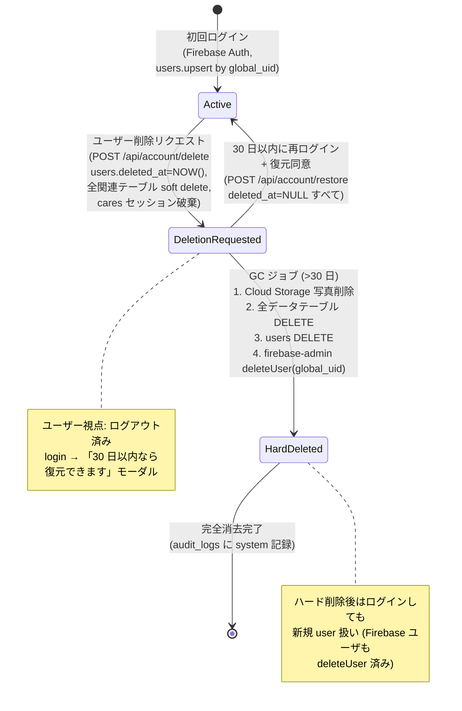

# account-deletion-state

```mermaid
%% 状態遷移図: アカウント削除のライフサイクル
%% FN-AUTH-07, BR-06/13/21, ADR-0014 と整合 (BR-19 Backchannel logout は ADR-0014 で廃止)
%% シーケンス詳細: ../../basic-design/architecture/sequence-deletion-request.md

stateDiagram-v2
    [*] --> Active: 初回ログイン<br/>(Firebase Auth,<br/> users.upsert by global_uid)

    Active --> DeletionRequested: ユーザー削除リクエスト<br/>(POST /api/account/delete<br/> users.deleted_at=NOW(),<br/> 全関連テーブル soft delete,<br/> cares セッション破棄)

    DeletionRequested --> Active: 30 日以内に再ログイン<br/>+ 復元同意<br/>(POST /api/account/restore<br/> deleted_at=NULL すべて)

    DeletionRequested --> HardDeleted: GC ジョブ (>30 日)<br/>1. Cloud Storage 写真削除<br/>2. 全データテーブル DELETE<br/>3. users DELETE<br/>4. firebase-admin deleteUser(global_uid)

    HardDeleted --> [*]: 完全消去完了<br/>(audit_logs に system 記録)

    note right of DeletionRequested
        ユーザー視点: ログアウト済み
        login → 「30 日以内なら
        復元できます」モーダル
    end note

    note right of HardDeleted
        ハード削除後はログインしても
        新規 user 扱い (Firebase ユーザも
        deleteUser 済み)
    end note
```
