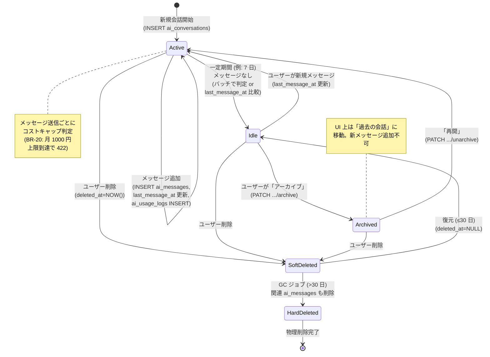

# ai-conversation-state

```mermaid
%% 状態遷移図: ai_conversations のライフサイクル
%% FN-AI-03 (会話型相談), BR-12/13 と整合

stateDiagram-v2
    [*] --> Active: 新規会話開始<br/>(INSERT ai_conversations)

    Active --> Active: メッセージ追加<br/>(INSERT ai_messages,<br/> last_message_at 更新,<br/> ai_usage_logs INSERT)
    Active --> Idle: 一定期間 (例: 7 日)<br/>メッセージなし<br/>(バッチで判定 or<br/> last_message_at 比較)

    Idle --> Active: ユーザーが新規メッセージ<br/>(last_message_at 更新)
    Idle --> Archived: ユーザーが「アーカイブ」<br/>(PATCH .../archive)
    Archived --> Active: 「再開」<br/>(PATCH .../unarchive)

    Active --> SoftDeleted: ユーザー削除<br/>(deleted_at=NOW())
    Idle --> SoftDeleted: ユーザー削除
    Archived --> SoftDeleted: ユーザー削除

    SoftDeleted --> Idle: 復元 (≤30 日)<br/>(deleted_at=NULL)
    SoftDeleted --> HardDeleted: GC ジョブ (>30 日)<br/>関連 ai_messages も削除

    HardDeleted --> [*]: 物理削除完了

    note right of Active
        メッセージ送信ごとに
        コストキャップ判定
        (BR-20: 月 1000 円
         上限到達で 422)
    end note

    note left of Archived
        UI 上は「過去の会話」に
        移動。新メッセージ追加不可
    end note
```
