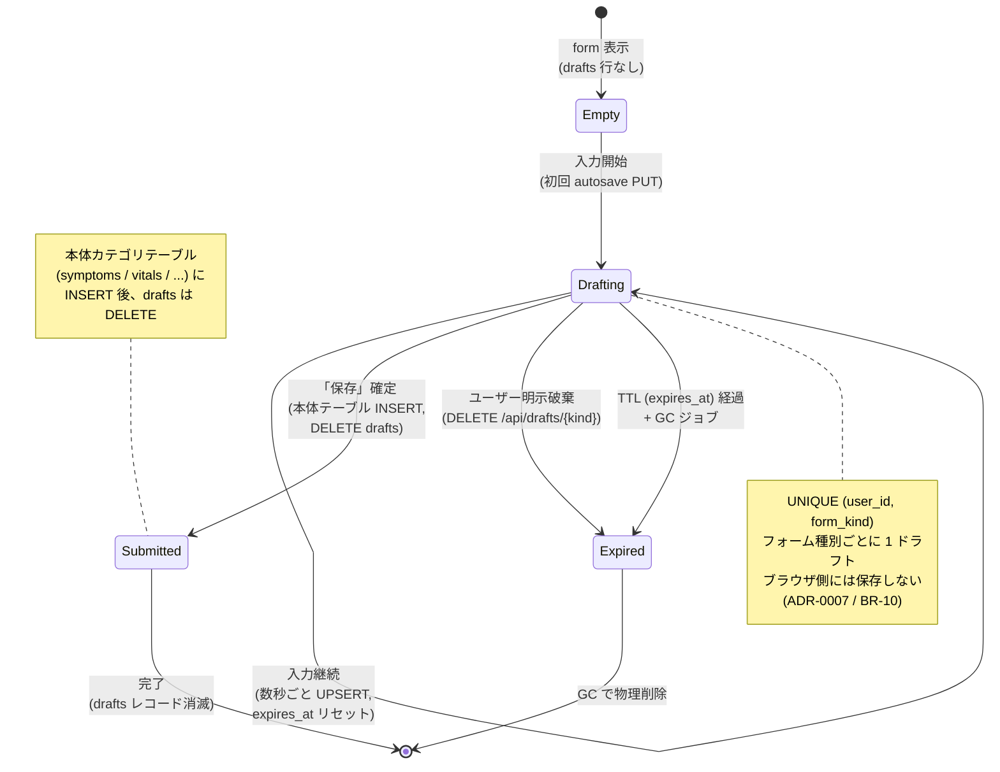

# draft-state

```mermaid
%% 状態遷移図: drafts (フォームドラフト) のライフサイクル
%% FN-DIARY-06, BR-15/10 と整合
%% ADR-0007 ブラウザ PII 禁止 → サーバ側 autosave

stateDiagram-v2
    [*] --> Empty: form 表示<br/>(drafts 行なし)
    Empty --> Drafting: 入力開始<br/>(初回 autosave PUT)
    Drafting --> Drafting: 入力継続<br/>(数秒ごと UPSERT,<br/> expires_at リセット)
    Drafting --> Submitted: 「保存」確定<br/>(本体テーブル INSERT,<br/> DELETE drafts)
    Drafting --> Expired: ユーザー明示破棄<br/>(DELETE /api/drafts/{kind})
    Drafting --> Expired: TTL (expires_at) 経過<br/>+ GC ジョブ

    Submitted --> [*]: 完了<br/>(drafts レコード消滅)
    Expired --> [*]: GC で物理削除

    note right of Drafting
        UNIQUE (user_id, form_kind)
        フォーム種別ごとに 1 ドラフト
        ブラウザ側には保存しない
        (ADR-0007 / BR-10)
    end note

    note left of Submitted
        本体カテゴリテーブル
        (symptoms / vitals / ...) に
        INSERT 後、drafts は DELETE
    end note
```
