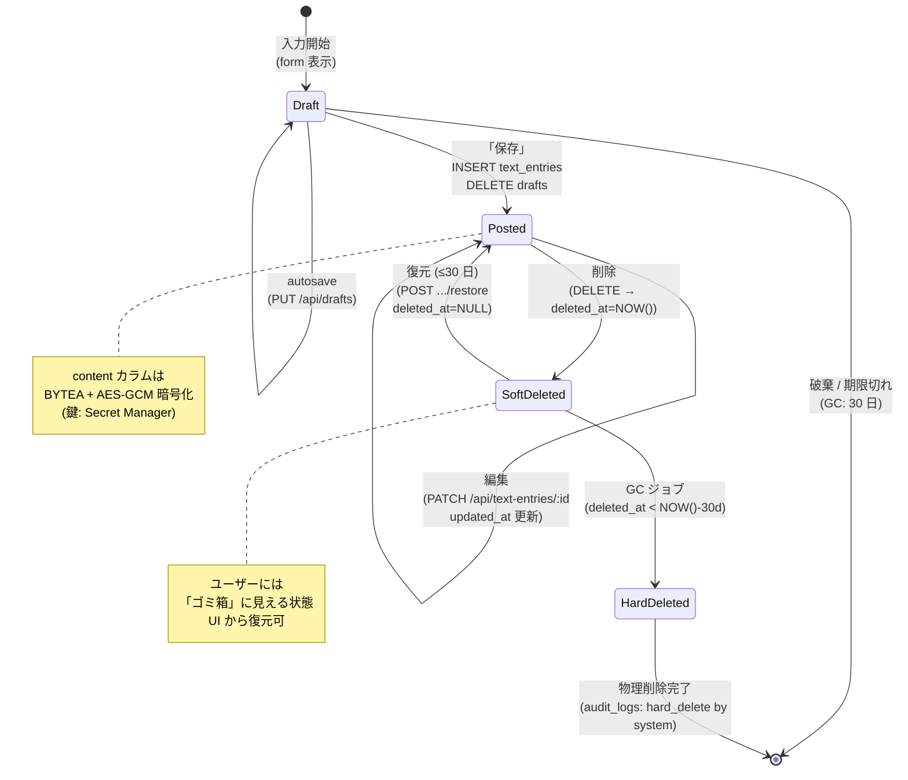

# text-entry-state

```mermaid
%% 状態遷移図: text_entries (テキスト記録) のライフサイクル
%% FN-DIARY-03/05/06, BR-06/21 と整合

stateDiagram-v2
    [*] --> Draft: 入力開始<br/>(form 表示)
    Draft --> Draft: autosave<br/>(PUT /api/drafts)
    Draft --> Posted: 「保存」<br/>INSERT text_entries<br/>DELETE drafts
    Draft --> [*]: 破棄 / 期限切れ<br/>(GC: 30 日)

    Posted --> Posted: 編集<br/>(PATCH /api/text-entries/:id<br/> updated_at 更新)
    Posted --> SoftDeleted: 削除<br/>(DELETE → deleted_at=NOW())
    SoftDeleted --> Posted: 復元 (≤30 日)<br/>(POST .../restore<br/> deleted_at=NULL)
    SoftDeleted --> HardDeleted: GC ジョブ<br/>(deleted_at < NOW()-30d)

    HardDeleted --> [*]: 物理削除完了<br/>(audit_logs: hard_delete by system)

    note right of Posted
        content カラムは
        BYTEA + AES-GCM 暗号化
        (鍵: Secret Manager)
    end note

    note right of SoftDeleted
        ユーザーには
        「ゴミ箱」に見える状態
        UI から復元可
    end note
```
