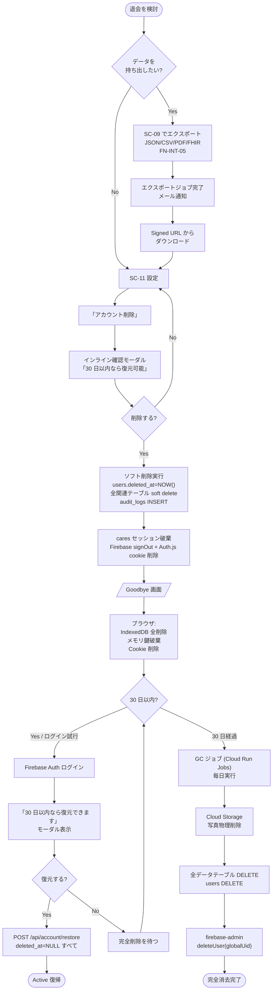

# activity-account-deletion

```mermaid
%% アクティビティ図: アカウント削除フロー (ユーザー視点)
%% FN-AUTH-07, BR-06/13/21, ADR-0014 と整合 (BR-19 Backchannel logout は ADR-0014 で廃止)
%% 詳細シーケンス: ../../basic-design/architecture/sequence-deletion-request.md
%% 状態遷移: ../../detail-design/state/account-deletion-state.md

flowchart TD
    Start([退会を検討]) --> Backup{データを<br/>持ち出したい?}
    Backup -->|Yes| Export[SC-09 でエクスポート<br/>JSON/CSV/PDF/FHIR<br/>FN-INT-05]
    Backup -->|No| OpenSettings
    Export --> Wait[エクスポートジョブ完了<br/>メール通知]
    Wait --> Download[Signed URL から<br/>ダウンロード]
    Download --> OpenSettings

    OpenSettings[SC-11 設定] --> DeleteBtn[「アカウント削除」]
    DeleteBtn --> Modal[インライン確認モーダル<br/>「30 日以内なら復元可能」]
    Modal --> Confirm{削除する?}
    Confirm -->|No| OpenSettings
    Confirm -->|Yes| Soft["ソフト削除実行<br/>users.deleted_at=NOW()<br/>全関連テーブル soft delete<br/>audit_logs INSERT"]

    Soft --> Logout[cares セッション破棄<br/>Firebase signOut + Auth.js cookie 削除]
    Logout --> Goodbye[/Goodbye 画面/]
    Goodbye --> Clear[ブラウザ:<br/>IndexedDB 全削除<br/>メモリ鍵破棄<br/>Cookie 削除]

    Clear --> Period{30 日以内?}

    %% 復元パス
    Period -->|Yes / ログイン試行| LoginAttempt[Firebase Auth ログイン]
    LoginAttempt --> Restore[「30 日以内なら復元できます」<br/>モーダル表示]
    Restore --> RestoreConfirm{復元する?}
    RestoreConfirm -->|Yes| Recover[POST /api/account/restore<br/>deleted_at=NULL すべて]
    Recover --> Active([Active 復帰])
    RestoreConfirm -->|No| Final[完全削除を待つ]
    Final --> Period

    %% ハード削除パス
    Period -->|30 日経過| GC["GC ジョブ (Cloud Run Jobs)<br/>毎日実行"]
    GC --> StorageDel[Cloud Storage<br/>写真物理削除]
    StorageDel --> DBDel[全データテーブル DELETE<br/>users DELETE]
    DBDel --> FBDel["firebase-admin<br/>deleteUser(globalUid)"]
    FBDel --> Done([完全消去完了])
```
