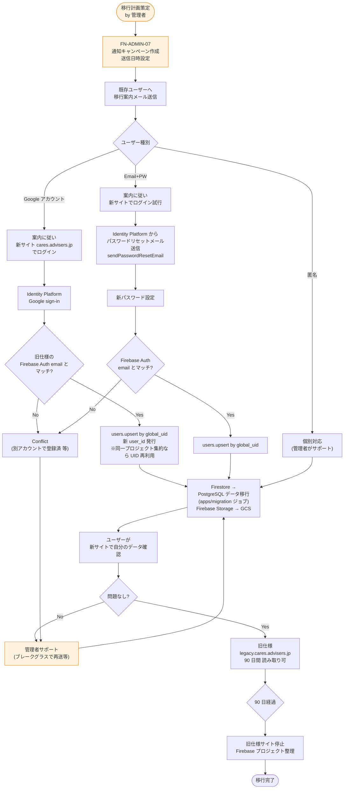

# activity-data-migration

```mermaid
%% アクティビティ図: 旧仕様 (stock-screener) から新仕様 (cares) への移行業務フロー
%% ADR-0010, FN-ADMIN-07 (通知キャンペーン) と整合
%% ADR-0014: 新旧とも Firebase Auth 基盤のため認証移行は大幅に単純化 (詳細は要再設計、ADR-0010 改訂注記参照)

flowchart TD
    Plan([移行計画策定<br/>by 管理者]) --> Notify[FN-ADMIN-07<br/>通知キャンペーン作成<br/>送信日時設定]
    Notify --> Send[既存ユーザーへ<br/>移行案内メール送信]

    Send --> UserTypeCheck{ユーザー種別}

    %% Google アカウントユーザー
    UserTypeCheck -->|Google アカウント| GoogleFlow[案内に従い<br/>新サイト cares.advisers.jp<br/>でログイン]
    GoogleFlow --> IDPGoogle[Identity Platform<br/>Google sign-in]
    IDPGoogle --> MatchG{旧仕様の<br/>Firebase Auth email と<br/>マッチ?}
    MatchG -->|Yes| AutoLinkG[users.upsert by global_uid<br/>新 user_id 発行<br/>※同一プロジェクト集約なら UID 再利用]
    AutoLinkG --> RestoreData

    %% Email+PW ユーザー
    UserTypeCheck -->|Email+PW| EmailFlow[案内に従い<br/>新サイトでログイン試行]
    EmailFlow --> IDPMagic[Identity Platform から<br/>パスワードリセットメール送信<br/>sendPasswordResetEmail]
    IDPMagic --> ResetPW[新パスワード設定]
    ResetPW --> MatchE{Firebase Auth<br/>email とマッチ?}
    MatchE -->|Yes| AutoLinkE[users.upsert by global_uid]
    AutoLinkE --> RestoreData

    %% 匿名ユーザー
    UserTypeCheck -->|匿名| AnonFlow["個別対応<br/>(管理者がサポート)"]
    AnonFlow --> RestoreData

    RestoreData["Firestore →<br/>PostgreSQL データ移行<br/>(apps/migration ジョブ)<br/>Firebase Storage → GCS"]
    RestoreData --> Verify[ユーザーが<br/>新サイトで自分のデータ確認]
    Verify --> OK{問題なし?}

    OK -->|No| Support["管理者サポート<br/>(ブレークグラスで再送等)"]
    Support --> RestoreData
    OK -->|Yes| Parallel[旧仕様<br/>legacy.cares.advisers.jp<br/>90 日間 読み取り可]

    Parallel --> After90{90 日経過}
    After90 --> Sunset[旧仕様サイト停止<br/>Firebase プロジェクト整理]
    Sunset --> End([移行完了])

    %% 失敗パス
    MatchG -->|No| Conflict["Conflict<br/>(別アカウントで登録済 等)"]
    MatchE -->|No| Conflict
    Conflict --> Support

    classDef admin fill:#fff3e0,stroke:#f57c00
    class Plan,Notify,Support admin
```
