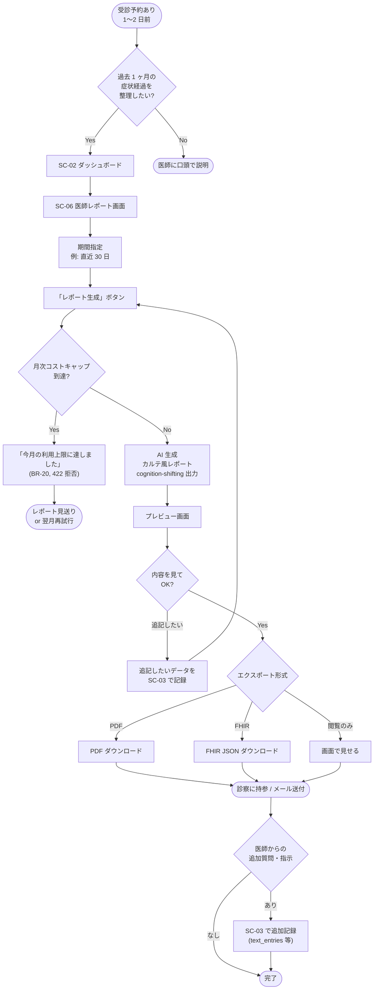

# activity-doctor-report

```mermaid
%% アクティビティ図: 医師受診前の医師レポート作成業務フロー
%% FN-AI-05, FN-INT-05 と整合
%% シーケンス詳細: ../../basic-design/architecture/sequence-doctor-report.md

flowchart TD
    Start([受診予約あり<br/>1〜2 日前]) --> Recall{過去 1 ヶ月の<br/>症状経過を<br/>整理したい?}
    Recall -->|Yes| Open
    Recall -->|No| End1([医師に口頭で説明])

    Open[SC-02 ダッシュボード] --> Select[SC-06 医師レポート画面]
    Select --> Period[期間指定<br/>例: 直近 30 日]
    Period --> Generate[「レポート生成」ボタン]

    Generate --> Quota{月次コストキャップ<br/>到達?}
    Quota -->|Yes| QuotaMsg["「今月の利用上限に達しました」<br/>(BR-20, 422 拒否)"]
    QuotaMsg --> End2([レポート見送り<br/>or 翌月再試行])
    Quota -->|No| AIRun[AI 生成<br/>カルテ風レポート<br/>cognition-shifting 出力]

    AIRun --> Preview[プレビュー画面]
    Preview --> Review{内容を見て<br/>OK?}
    Review -->|追記したい| Append[追記したいデータを<br/>SC-03 で記録]
    Append --> Generate
    Review -->|Yes| ChooseExport{エクスポート形式}

    ChooseExport -->|PDF| PDF[PDF ダウンロード]
    ChooseExport -->|FHIR| FHIR[FHIR JSON ダウンロード]
    ChooseExport -->|閲覧のみ| View[画面で見せる]

    PDF --> Bring([診察に持参 / メール送付])
    FHIR --> Bring
    View --> Bring

    Bring --> Followup{医師からの<br/>追加質問・指示}
    Followup -->|あり| Memo["SC-03 で追加記録<br/>(text_entries 等)"]
    Followup -->|なし| End3([完了])
    Memo --> End3
```
