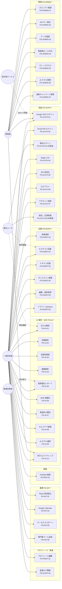

# ユースケース図 — cares 健康日記

要件定義書 §3 (アクター) / §4.1 (機能一覧 FN-*) と整合。Mermaid に正規ユースケース図がないため flowchart で表現。

```mermaid
flowchart LR
    %% アクター
    User((一般利用者))
    Anon((匿名ユーザ))
    Admin((管理者))
    Doctor((医療従事者))
    OtherSvc((自社他サービス))

    %% 認証
    subgraph Auth["認証 FN-AUTH-*"]
        UC_LOGIN_G[Google SSO ログイン<br/>FN-AUTH-01]
        UC_LOGIN_E[Email PW ログイン<br/>FN-AUTH-02]
        UC_LOGIN_A[匿名ログイン<br/>FN-AUTH-03 未実装]
        UC_LOGIN_M[Magic Link<br/>FN-AUTH-04]
        UC_2FA[2FA 有効化<br/>FN-AUTH-05]
        UC_LOGOUT[ログアウト<br/>FN-AUTH-06]
        UC_DELETE_ACC[アカウント削除<br/>FN-AUTH-07]
        UC_UPGRADE[匿名→正規昇格<br/>FN-AUTH-08 未実装]
    end

    %% 記録
    subgraph Diary["記録 FN-DIARY-*"]
        UC_DISEASE[疾患選択<br/>FN-DIARY-01]
        UC_RECORD9[9 カテゴリ記録<br/>FN-DIARY-02]
        UC_TEXT[テキスト記録<br/>FN-DIARY-03]
        UC_TIMELINE[タイムライン閲覧<br/>FN-DIARY-04]
        UC_EDIT[編集・個別削除<br/>FN-DIARY-05]
        UC_DRAFT[ドラフト autosave<br/>FN-DIARY-06]
    end

    %% AI
    subgraph AI["AI 解析・出力 FN-AI-*"]
        UC_AI_DAILY[日々の解析<br/>FN-AI-01]
        UC_AI_DEEP[深堀解析<br/>FN-AI-02]
        UC_AI_CHAT[会話型相談<br/>FN-AI-03]
        UC_AI_IMG[画像解析<br/>FN-AI-04]
        UC_AI_REPORT[医師提出レポート<br/>FN-AI-05]
        UC_AI_SNS[SNS 用要約<br/>FN-AI-06]
        UC_AI_FAM[家族向け要約<br/>FN-AI-07]
        UC_AI_SELF[セルフケア提案<br/>FN-AI-08]
        UC_AI_MODEL[AI モデル選択<br/>FN-AI-09]
        UC_AI_QUOTA[月次コストキャップ<br/>FN-AI-10]
    end

    %% 調査・連携
    subgraph Research["調査"]
        UC_PUBMED[PubMed 検索<br/>FN-RES-01]
    end

    subgraph Integration["連携 FN-INT-*"]
        UC_PLAUD[Plaud 受信取込<br/>FN-INT-01]
        UC_GCAL[Google Calendar<br/>FN-INT-04]
        UC_EXPORT[データエクスポート<br/>FN-INT-05]
        UC_PRO_MAIL[専門家メール送信<br/>FN-INT-06]
    end

    %% プロファイル・監査
    subgraph Account["プロフィール・監査"]
        UC_PROF[プロフィール編集<br/>FN-PROF-01]
        UC_AUDIT[監査ログ閲覧<br/>FN-AUDIT-01]
    end

    %% 管理者
    subgraph AdminF["管理 FN-ADMIN-*"]
        UC_PROMPT[プロンプト管理<br/>FN-ADMIN-01]
        UC_KEY[API キー設定<br/>FN-ADMIN-02]
        UC_DATA[データ管理<br/>FN-ADMIN-03]
        UC_ROLE[管理者ロール付与<br/>FN-ADMIN-04]
        UC_BREAK[ブレークグラス<br/>FN-ADMIN-05]
        UC_MODELS[AI モデル管理<br/>FN-ADMIN-06]
        UC_NOTIFY[通知キャンペーン管理<br/>FN-ADMIN-07]
    end

    %% アクター → ユースケース
    User --> UC_LOGIN_G
    User --> UC_LOGIN_E
    User --> UC_LOGIN_M
    User --> UC_2FA
    User --> UC_LOGOUT
    User --> UC_DELETE_ACC
    User --> UC_DISEASE
    User --> UC_RECORD9
    User --> UC_TEXT
    User --> UC_TIMELINE
    User --> UC_EDIT
    User --> UC_DRAFT
    User --> UC_AI_DAILY
    User --> UC_AI_DEEP
    User --> UC_AI_CHAT
    User --> UC_AI_IMG
    User --> UC_AI_REPORT
    User --> UC_AI_SNS
    User --> UC_AI_FAM
    User --> UC_AI_SELF
    User --> UC_AI_MODEL
    User --> UC_AI_QUOTA
    User --> UC_PUBMED
    User --> UC_PLAUD
    User --> UC_GCAL
    User --> UC_EXPORT
    User --> UC_PRO_MAIL
    User --> UC_PROF
    User --> UC_AUDIT

    Anon --> UC_LOGIN_A
    Anon --> UC_UPGRADE
    Anon -.->|限定機能| UC_RECORD9
    Anon -.->|限定機能| UC_AI_DAILY

    Admin --> UC_LOGIN_G
    Admin --> UC_PROMPT
    Admin --> UC_KEY
    Admin --> UC_DATA
    Admin --> UC_ROLE
    Admin --> UC_BREAK
    Admin --> UC_MODELS
    Admin --> UC_NOTIFY
    Admin --> UC_AI_QUOTA

    Doctor -.->|読み取り| UC_AI_REPORT
    OtherSvc -.->|SSO で参照| UC_LOGIN_G
```
