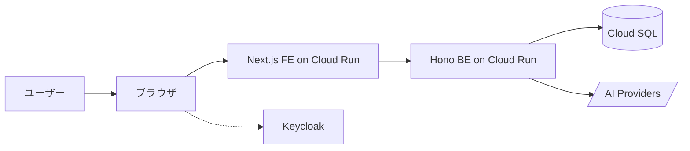

# 基本設計書 v2（健康日記 / cares）

新仕様 cares の **どう作るか（全体像・方式）** を示す上位文書。詳細は ADR と詳細設計書を参照する。

- 対象システム: 健康日記（旧名: 未病ダイアリー）の GCP 全面リアーキテクチャ版
- 旧仕様参照: [`../docs_restruct/basic-design/基本設計書.md`](../../docs_restruct/basic-design/基本設計書.md)
- ADR 索引: [`../adr/README.md`](../adr/README.md)
- 要件定義書 v2: 作成予定（フェーズ 3）。当面はインタビュー記録 [`../requirements/interview-log.md`](../requirements/interview-log.md) を参照

## 1. 全体構成

ユーザーはブラウザから cares.advisers.jp にアクセスし、Keycloak（中央 IdP）でログインし、cares 本体の機能を利用する。



詳細図は [`architecture/component.mmd`](architecture/component.mmd) と [`architecture/deployment.mmd`](architecture/deployment.mmd) を参照。

## 2. 技術スタック

| レイヤ | 技術 | 採用 ADR |
|---|---|---|
| フロントエンド | TypeScript + Next.js (App Router) + Tailwind + shadcn/ui + PWA | [ADR-0003](../adr/0003-frontend-stack-nextjs.md) |
| バックエンド | TypeScript + Hono + Prisma + REST/OpenAPI/Zod | [ADR-0004](../adr/0004-backend-stack-typescript-hono-prisma.md) |
| 認証 | Keycloak セルフホスト中央 IdP + OIDC RP | [ADR-0002](../adr/0002-sso-lv2-with-keycloak.md) |
| DB | Cloud SQL for PostgreSQL | [ADR-0005](../adr/0005-gcp-services-and-environments.md) |
| ホスティング | Cloud Run（asia-northeast1） | [ADR-0005](../adr/0005-gcp-services-and-environments.md) |
| ストレージ | Cloud Storage | [ADR-0005](../adr/0005-gcp-services-and-environments.md) |
| シークレット | Secret Manager | [ADR-0005](../adr/0005-gcp-services-and-environments.md), [ADR-0006](../adr/0006-ai-provider-strategy.md) |
| AI | Anthropic / OpenAI / Gemini（サーバ専有鍵） | [ADR-0006](../adr/0006-ai-provider-strategy.md) |
| 監視 | Cloud Logging + Cloud Monitoring | [ADR-0005](../adr/0005-gcp-services-and-environments.md) |
| IaC | Terraform | [ADR-0005](../adr/0005-gcp-services-and-environments.md) |
| CI/CD | GitHub Actions | [ADR-0005](../adr/0005-gcp-services-and-environments.md) |

## 3. システム境界

```
┌─────────────────────────────────────────────────────────┐
│  cares (このリポジトリのスコープ)                          │
│  ┌─────────────┐  ┌──────────┐  ┌────────────┐         │
│  │ Next.js FE  │→ │ Hono BE  │→ │ Cloud SQL  │         │
│  └─────────────┘  └──────────┘  └────────────┘         │
└─────────────────────────────────────────────────────────┘
         ↑                  ↓                  ↓
┌───────────────┐   ┌──────────────┐   ┌──────────────┐
│ Keycloak       │   │ AI Providers │   │ Google       │
│ (identity 別  │   │ Anthropic    │   │ Calendar etc │
│  プロジェクト) │   │ OpenAI       │   └──────────────┘
└───────────────┘   │ Gemini       │
                    └──────────────┘
```

- cares の責任範囲: ユーザー向け Web 画面、ユーザーデータ管理、AI 呼び出し、外部連携の orchestration
- cares の責任外: 認証（Keycloak）、AI 推論（外部 SaaS）、メール送信（外部 SaaS）

## 4. データフロー概要

### 4.1 認証フロー（OIDC）

ユーザーがログインボタンを押すと、Keycloak へ redirect。Keycloak は内部で Google OAuth とフェデレーションし、ID token を発行。FE は token を検証し、HttpOnly Cookie でセッション確立。

→ 詳細: [`architecture/sequence-auth.mmd`](architecture/sequence-auth.mmd)

### 4.2 AI 呼び出しフロー（ストリーミング）

ブラウザからの AI 質問は BE で受け取り、Secret Manager から鍵取得 → Anthropic 等にストリーミング呼び出し → SSE で BE → FE → Browser に転送。完了後、トークン使用量をログに記録、コストキャップを更新。

→ 詳細: [`architecture/sequence-ai.mmd`](architecture/sequence-ai.mmd)

### 4.3 データ書き込みフロー

ブラウザからの POST → FE (Server Action or Route Handler) で軽い検証 → BE の REST API → Zod でバリデーション → Prisma で Cloud SQL に書き込み → 監査ログ記録 → クライアントへ結果返却。ブラウザ側 IndexedDB は暗号化キャッシュとして用途別に最小限利用。

## 5. ID とテナント設計

### 5.1 ユーザー ID

- **global_uid**: Keycloak が OIDC `sub` クレームで発行する、サービス横断のグローバル ID
- 各サービスは内部に `users` テーブルを持ち、`global_uid` と `local_user_id (UUID)` を `user_link` で紐付け
- `local_user_id` のみがアプリ内 FK で使われる（global_uid は認可境界の入口のみ）

### 5.2 テナント ID

- 全ユーザーデータテーブルに `tenant_id` を含める
- MVP では `tenant_id = users.local_user_id`（個人テナント）
- 将来 B2B 化時に組織を表す tenant_id にユーザーをぶら下げる

→ 詳細: [ADR-0008](../adr/0008-multi-tenant-ready-schema.md), ER 図 [`er/`](er/) （フェーズ 3 で作成）

## 6. セキュリティ方針

### 6.1 データ保管

- 個人情報は Cloud SQL（東京リージョン、Private IP）に集約
- 写真・添付は Cloud Storage（暗号化保管）
- バックアップは PITR + 30 日保持

### 6.2 鍵管理

- すべての API 鍵・秘密値は Secret Manager
- ブラウザに鍵を渡さない（旧仕様継続）
- AI Provider 鍵は BE が Workload Identity で取得

### 6.3 ブラウザストレージ

- **localStorage / sessionStorage**: PII 完全禁止
- **IndexedDB**: 暗号化（AES-GCM）して一時キャッシュとしてのみ許容、セッション中限定
- **Cookie**: HttpOnly + Secure + SameSite=Strict のセッションのみ

→ 詳細: [ADR-0007](../adr/0007-browser-pii-prohibition.md)

### 6.4 認可ガード

- 全 API は OIDC ID token を検証
- 管理 API は 3 段フェイルセーフ（Keycloak ロール OR オーナーメール OR ブレークグラストークン）

→ 詳細: [ADR-0011](../adr/0011-admin-model-with-failsafe.md)

### 6.5 監査ログ

- すべてのデータアクセス（read / write / delete / export）を `audit_logs` テーブルに記録
- ユーザー本人にも公開（誰がいつアクセスしたか確認できる UI）
- Cloud Audit Logs と併用

## 7. 環境戦略

| 環境 | GCP プロジェクト | URL |
|---|---|---|
| prod | cares-prod / identity-prod | cares.advisers.jp / identity.advisers.jp |
| staging | cares-staging / identity-staging | staging.cares.advisers.jp |
| dev | cares-dev / identity-dev | dev.cares.advisers.jp |
| shared | shared | （Artifact Registry / 集約監視） |

→ 詳細: [ADR-0005](../adr/0005-gcp-services-and-environments.md), [`architecture/deployment.mmd`](architecture/deployment.mmd)

## 8. デプロイ・運用方針

### 8.1 デプロイ

- GitHub Actions で main へのマージ → Artifact Registry にイメージ push → Cloud Run へデプロイ
- staging を経て prod へ手動承認で昇格
- Terraform でインフラを管理、Pull Request レビュー必須

### 8.2 監視・アラート

- Cloud Monitoring でレイテンシ・エラー率・ヘルスチェックを監視
- 重大エラーは Slack / メール通知
- Cloud Logging で構造化ログ
- アプリ層では監査ログを `audit_logs` に保存（DB）

### 8.3 バックアップ・DR

- Cloud SQL 自動バックアップ + PITR 30 日保持
- DR テストは半年に 1 回 PITR からの復元演習

→ 詳細: [ADR-0012](../adr/0012-nfr-baseline.md)

## 9. リポジトリ構造（想定）

```
agewaller/cares (GitHub)
├─ apps/
│  ├─ web/         # Next.js FE (Cloud Run)
│  ├─ api/         # Hono BE (Cloud Run)
│  └─ migration/   # データ移行スクリプト
├─ packages/
│  ├─ shared/      # 共有 Zod スキーマ・型定義
│  └─ db/          # Prisma schema + client
├─ infra/
│  ├─ terraform/   # GCP インフラ定義
│  └─ keycloak/    # Keycloak Realm 設定 (JSON エクスポート)
├─ docs/           # docs_cares/ をここに移植
└─ .github/
   └─ workflows/   # CI/CD
```

## 10. 関連ドキュメント

- [ADR 一覧](../adr/README.md)
- [インタビュー記録 / 要件定義の暫定](../requirements/interview-log.md)
- [コンポーネント図](architecture/component.mmd)
- [デプロイ構成図](architecture/deployment.mmd)
- [認証シーケンス](architecture/sequence-auth.mmd)
- [AI 呼び出しシーケンス](architecture/sequence-ai.mmd)

## 11. 外部連携・データ移行

外部連携の移植優先度と方針は [ADR-0009](../adr/0009-integration-porting-priorities.md)。MVP 必須は Google Calendar / CSV エクスポート / 専門家メール送信 / Plaud、フェーズ 5 後半に Fitbit / Apple Health / CSV インポート。

旧仕様からの移行は [ADR-0010](../adr/0010-data-migration-strategy.md)。データ・アカウントとも自動移行、cares.advisers.jp ドメイン継続、旧システムは `legacy.cares.advisers.jp` として 90 日間並走。

## 12. 完成した補助ドキュメント

- [要件定義書 v2](../requirements/要件定義書.md) — 12 論点を反映した正式版
- [ER 図](er/er.mmd) と [DB スキーマ詳細](er/schema.md)
- [API 一覧](../detail-design/api/api-list.md) と [OpenAPI 仕様](../detail-design/api/openapi.yaml)
- [詳細設計書 v2](../detail-design/詳細設計書.md) — 認証/暗号化/監査/コスト管理/Keycloak/テスト/デプロイ等

## 13. 残作業

- 画面一覧（SC-NN）の整理（フェーズ 3 後半 or フェーズ 4 着手時）
- B2B 拡張時の追加設計（将来）
- 家族・医師共有機能の詳細 UX（MVP 後）
