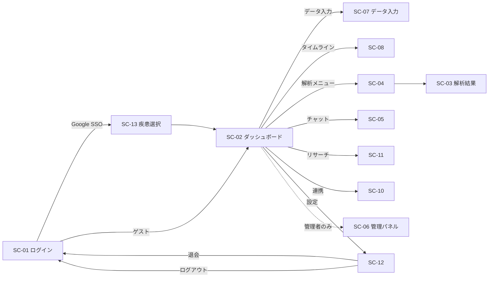

# 基本設計書 — 健康日記（Health Diary）

> 本書は「どう作るか」を全体像・方式レベルで as-built 記述する。要件は [要件定義書](../requirements/要件定義書.md)、実装直前の粒度は [詳細設計書](../detail-design/詳細設計書.md) を参照。

## 1. システム方式設計（アーキテクチャ）

### 1.1 全体構成

3 つの独立した基盤（GitHub Pages / Cloudflare Workers / Firebase）+ 外部 AI プロバイダ + 外部統合（PubMed / Plaud / Fitbit 等）からなる **静的フロント + サーバレス API** アーキテクチャ。フロントエンドは vanilla JavaScript SPA で、ビルド工程を持たない。

- コンポーネント図: [architecture/component.mmd](architecture/component.mmd) — [README](architecture/README.md)

### 1.2 技術スタック（採用済み）

| レイヤ | 技術 | 備考 |
|---|---|---|
| フロントエンド | Vanilla JavaScript（ES2017+）、`morphdom` | フレームワークなし、ビルドなし |
| HTML/CSS | `index.html` 単一ファイル + 13 個の `js/*.js` | テンプレートリテラルで HTML 生成 |
| ホスティング | GitHub Pages（カスタムドメイン `cares.advisers.jp`） | mainブランチ push で自動デプロイ |
| 認証 | Firebase Authentication | Google OAuth / Email-Password / Anonymous |
| DB | Firebase Firestore | 東京リージョン、プロジェクト `care-14c31` |
| AI プロキシ | Cloudflare Workers（6 個） | 鍵保持・CORS・stream 中継 |
| AI プロバイダ | Anthropic Claude / OpenAI / Google Gemini | Worker 経由で呼び出し |
| 外部 API | NCBI PubMed E-utilities | ブラウザから直接（CORS 不要） |
| 多言語 | 内製 i18n（`js/i18n.js`） | 10 言語 |
| Service Worker | `sw.js` | オフラインキャッシュ |
| 補助スクリプト | Node.js + `firebase-admin` | `scripts/seed-prompts.mjs` で初期投入 |

### 1.3 JS モジュール構成（読込順 = 依存順）

```
1. js/config.js          ← CONFIG（疾患・モデル・処方軸 等の定数）
2. js/prompts.js         ← PROMPT_HEADER + DEFAULT_PROMPTS + INLINE_PROMPTS
3. js/store.js           ← Store（状態管理 + localStorage 永続化 + Firestore 同期フック）
4. js/privacy.js         ← PII マスキング
5. js/ai-engine.js       ← AIEngine + PubMed + MODEL_MAP
6. js/affiliate.js       ← 商品レコメンド
7. js/components.js      ← UI ヘルパー（escapeHtml, formatMarkdown 等）
8. js/i18n.js            ← 多言語
9. js/calendar.js        ← Google Calendar / ICS
10. js/integrations.js   ← Plaud / Fitbit / Apple Health / CSV
11. js/firebase-backend.js ← Firebase Auth + Firestore 同期
12. js/app.js            ← App クラス（メインロジック、ナビ、フォーム）
13. js/pages.js          ← App.prototype.render_*（全画面レンダラー）
```

### 1.4 レイヤ構成（実行時）

```
[Browser (cares.advisers.jp on GitHub Pages)]
  ├─→ [Firebase Auth / Firestore]         （ブラウザから直接）
  ├─→ [Cloudflare Worker: cares-relay]    → service binding → [Worker: stock-screener]
  │                                                              ├─→ [Anthropic Claude API]
  │                                                              ├─→ [OpenAI API]
  │                                                              └─→ [Google Gemini API]
  ├─→ [NCBI PubMed]                       （ブラウザから直接、CORS 許可）
  └─→ [Worker: professional-mailer]       （専門家への問い合わせメール送信）

[Email]
  └─→ [Worker: plaud-inbox]               → [Firestore: inbox/{hash}/plaud/{messageId}]
```

### 1.5 外部サービス連携一覧

| サービス | 用途 | 経路 / プロトコル |
|---|---|---|
| Firebase Auth | 認証（Google / Email / Anonymous） | Firebase JS SDK |
| Firebase Firestore | データ永続化 | Firebase JS SDK（onSnapshot listener） |
| Anthropic Claude | AI 解析（既定） | ブラウザ → relay → stock-screener → Anthropic |
| OpenAI GPT-4o | AI 解析（選択時） | 同上 |
| Google Gemini 2.5 Pro | AI 解析（選択時） | 同上 |
| PubMed (NCBI) | 論文検索 | ブラウザから直接 fetch（無認証） |
| Plaud | 音声録音取り込み | Cloudflare Email Worker → Firestore |
| Fitbit | 歩数・睡眠データ | OAuth2 |
| Apple Health | CSV インポート | ファイル選択 |
| Google Calendar | 通院予定 | OAuth2 / ICS |
| Resend (or SendGrid) | 専門家への問い合わせメール送信 | Worker 経由 |

### 1.6 環境構成

| 環境 | URL | 用途 |
|---|---|---|
| 本番 | <https://cares.advisers.jp> | 利用者向け |
| AI プロキシ本番 | <https://ai.cares.advisers.jp> | cares-relay Worker のカスタムドメイン |
| AI プロキシフォールバック | `cares-relay.agewaller.workers.dev` | カスタムドメイン障害時 |

> 開発 / ステージング環境は明示的には分離されていない（buildless 構成のためローカル `python -m http.server` で `index.html` を直接開発）。

## 2. 画面設計

### 2.1 画面一覧

`render_*`（pages.js）の 13 個のレンダラーを画面 ID に対応させる。

| 画面 ID | レンダラー | 画面名 | 主目的 | 認証 |
|---|---|---|---|---|
| SC-01 | `render_login` | ログイン / ランディング | サービス紹介・SSO ログイン | 不要 |
| SC-02 | `render_dashboard` | ダッシュボード | 当日入力・直近データ・AI コメント | 必要 |
| SC-03 | `render_analysis` | AI 解析結果 | 日々解析の結果表示 | 必要 |
| SC-04 | `render_actions` | アクション / 解析メニュー | 深堀解析・医師レポート・SNS・近親者向け要約 | 必要 |
| SC-05 | `render_chat` | 会話型相談 | チャット UI で AI と対話 | 必要 |
| SC-06 | `render_admin` | 管理パネル | プロンプト / API 鍵 / Firebase 設定 / データ管理 | 必要（管理者） |
| SC-07 | `render_data_input` | データ入力 | 9 カテゴリのフォーム | 必要 |
| SC-08 | `render_timeline` | タイムライン | 時系列のデータ・解析・コメント統合 | 必要 |
| SC-09 | `render_privacy` | プライバシー | プライバシーポリシー表示 | 不要 |
| SC-10 | `render_integrations` | 外部連携 | Plaud / Fitbit / Apple Health / Calendar / CSV | 必要 |
| SC-11 | `render_research` | リサーチ / 専門家 | PubMed 検索 + 専門家リスト + 問い合わせ | 必要 |
| SC-12 | `render_settings` | アカウント設定 | プロフィール・モデル選択・言語・ログアウト・退会 | 必要 |
| SC-13 | `render_disease_select` | 疾患選択 | 65 疾患 + カスタムから選択 | 必要 |

加えて、ルート直下に 65 個の SEO ランディング HTML（`adhd.html`, `depression.html` 等）が存在する。これらは SPA 外の **静的ページ**で、CTA から `https://cares.advisers.jp/?d={disease_id}` 形式で SPA に着地する。

### 2.2 画面遷移（概略）



### 2.3 共通 UI 規約

- フレームワークなし。テンプレートリテラルで HTML を返す
- DOM 更新は `morphdom` で差分パッチ（フォーカス・スクロール保持）
- ユーザ入力は `Components.escapeHtml()` で escape してから挿入
- ライトテーマ固定（`:root` 変数）
- `confirm()` / `alert()` 禁止 → インラインモーダル UI で代替
- モバイル / デスクトップ両対応のレスポンシブ
- ユーザ向け文言から「AI」リテラルを除外

## 3. ドメインモデル設計

### 3.1 主要エンティティ

| エンティティ | 責務 | 永続化先 |
|---|---|---|
| User | 認証された利用者 | Firebase Auth + Firestore `users/{uid}` |
| Profile | 表示名・年齢・性別・薬等のメタ情報 | Firestore `users/{uid}` doc |
| DiseaseSelection | ユーザが選択している疾患 ID 群 | Firestore `users/{uid}` フィールド |
| Symptom | 1 件の体調記録 | Firestore `users/{uid}/symptoms/{id}` |
| Vital | バイタル記録 | Firestore `users/{uid}/vitals/{id}` |
| BloodTest | 血液検査結果 | Firestore `users/{uid}/bloodTests/{id}` |
| Medication | 服薬記録 | Firestore `users/{uid}/medications/{id}` |
| Meal | 食事記録 | Firestore `users/{uid}/meals/{id}` |
| SleepData | 睡眠記録 | Firestore `users/{uid}/sleepData/{id}` |
| Photo | 画像（食事・検査・処方箋等） | Firestore `users/{uid}/photos/{id}` |
| TextEntry | 自由記述メモ | Firestore `users/{uid}/textEntries/{id}` |
| AnalysisRecord | AI 解析履歴 | Firestore `users/{uid}/analysisHistory/{id}` |
| DeepAnalysis | 本格解析の履歴（1 日 1 回上限） | Firestore `users/{uid}/deepAnalyses/{id}` |
| DoctorReport | 医師提出用レポート | Firestore `users/{uid}/doctorReports/{id}` |
| ConversationMessage | チャット履歴 1 件 | Firestore `users/{uid}/conversationHistory/{id}` |
| PlaudAnalysis | Plaud 取り込み結果 | Firestore `users/{uid}/plaudAnalyses/{id}` |
| InboxMessage | Plaud / data メール受信生データ | Firestore `inbox/{hash}/{kind}/{messageId}` |
| Prompt | プロンプトテンプレート | Firestore `prompts/{key}` + `versions/{version}` |
| ApiUsage | AI API 利用ログ（token / cost） | Firestore `users/{uid}/apiUsage/{id}` |

### 3.2 集約境界

- **User 集約**: User をルートに、各種データサブコレクションを含む
- **Inbox 集約**: ユーザの uid とは別の **hash（email/uid 由来）** で識別。Worker が書き込み、SPA が処理済みマーク
- **Admin 集約**: `prompts/` `aiModes/` 等の全ユーザ共有設定

### 3.3 用語マッピング

| ユビキタス言語 | 実装名 | Firestore コレクション |
|---|---|---|
| 利用者 | User | `users/{uid}` |
| 受信箱（音声録音メール） | InboxMessage | `inbox/{hash}/plaud/{id}` |
| プロンプト | Prompt | `prompts/{key}` |

## 4. 機能設計

### 4.1 機能 × 画面 × API マトリクス（抜粋）

| 機能 ID | 画面 | 主要 API（Worker / Firestore） |
|---|---|---|
| FN-AUTH-01 | SC-01 | Firebase Auth: `signInWithRedirect(Google)` |
| FN-AUTH-02 | SC-01 | Firebase Auth: `signInWithEmailAndPassword` |
| FN-AUTH-03 | SC-01 | Firebase Auth: `signInAnonymously` |
| FN-DIARY-02 | SC-07 | Firestore: `addDoc(users/{uid}/{collection})` |
| FN-AI-01 | SC-02 | `POST /v1/messages`（Worker） |
| FN-AI-02 | SC-04 | `POST /v1/messages`（stream） |
| FN-AI-03 | SC-05 | `POST /v1/messages`（stream） |
| FN-AI-04 | SC-07 | `POST /v1/messages`（Vision: imageBase64） |
| FN-RES-01 | SC-11 | `eutils.ncbi.nlm.nih.gov/esearch + esummary` |
| FN-INT-01 | SC-10 | Firestore listener: `inbox/{hash}/plaud` |
| FN-INT-06 | SC-11 | `POST {professional-mailer Worker}` |
| FN-ADMIN-02 | SC-06 | `POST /admin/keys`（Worker、Firebase ID トークン認証） |

### 4.2 主要機能の処理方針

#### FN-AI-01〜FN-AI-08（AI 呼び出し全般）

1. SPA で `aiEngine.callModel(modelId, prompt, options)` を呼ぶ
2. プロンプトは `interpolatePrompt()` で `PROMPT_HEADER` + 言語指示 + 疫学コンテキスト + 14 軸処方プロトコル + 個別テンプレ + ユーザデータ JSON を組み立て
3. モデル種別を `MODEL_MAP` で API ID に解決
4. プロバイダフォールバックチェーン（Claude の場合 Opus → Sonnet → Haiku）を構築
5. 1 回 30 秒タイムアウト、全体 55 秒タイムアウトで `AbortController` 付き fetch
6. Anthropic は `cares-relay` 経由で `stock-screener` Worker に到達
7. Worker が KV `admin:key:anthropic` または env secret から API 鍵を注入してプロバイダに転送
8. stream モードならレスポンスをそのまま素通し、SPA は SSE をインクリメンタルに表示
9. レスポンスから `usage.input_tokens / output_tokens` を取得し `apiUsage` に記録

#### FN-INT-01（Plaud メール取り込み）

1. ユーザの受信用メアド `plaud-{hash}@inbox.cares.advisers.jp` 宛にメール送信
2. Cloudflare Email Routing が `plaud-inbox` Worker にディスパッチ
3. Worker がメール本文をパースし `inbox/{hash}/plaud/{messageId}` に書き込み
4. SPA の Firestore listener（`firebase-backend.js`）が新規ドキュメントを検知
5. 自動的に AI 解析を起動（FN-AI-04 経路）
6. 解析結果を `plaudAnalyses` に書き込み、`inbox/.../processed=true` でマーク

#### FN-AI-02（本格的な深堀解析、1 日 1 回制限）

1. 実行ボタン押下時に `store.get('deepAnalysisLastRun')`（JST 日付）と当日を比較
2. 既に実行済みならボタン無効化
3. 蓄積データ全体（過去 N 日のすべてのカテゴリ）を JSON 化してプロンプトに注入
4. Opus 4.6 で stream 解析
5. 結果を `deepAnalyses` に保存し `deepAnalysisLastRun` を更新

## 5. API 基本設計

### 5.1 API 一覧（Cloudflare Worker）

| Worker | メソッド | パス | 概要 | 認証 |
|---|---|---|---|---|
| cares-relay | （全てパススルー） | `/*` | service binding で stock-screener へ転送 | Origin 検証 |
| stock-screener | POST | `/v1/messages` | Anthropic Claude Messages API（stream 対応） | Origin 検証 |
| stock-screener | POST | `/v1/ai` | 汎用 AI（provider=openai\|google） | Origin 検証 |
| stock-screener | POST | `/admin/keys` | API 鍵保存 | Firebase ID Token または `x-admin-token` |
| stock-screener | GET | `/admin/key-status` | 鍵設定状況のみ返却（**鍵値は返さない**） | Firebase ID Token または `x-admin-token` |
| plaud-inbox | （Email） | — | Cloudflare Email Routing から呼ばれる | — |
| professional-mailer | POST | （未公開） | 専門家への問い合わせメール送信 | Firebase ID Token |
| research-updater | （cron） | — | 研究データ更新 | — |
| learning-orchestrator | — | — | 別プロダクト連携（jsrm 系、本書スコープ外） | — |

詳細仕様は [`detail-design/api/api-list.md`](../detail-design/api/api-list.md) を参照。

### 5.2 API 設計方針

- スタイル: **REST**（パスはリソース指向）
- フォーマット: JSON
- 認証: Firebase ID Token を `Authorization: Bearer <token>` で送る（admin 系のみ）
- Origin チェック: `https://cares.advisers.jp` を許可リストで明示
- ストリーミング: Anthropic SSE をそのまま素通し
- 鍵保管: `/admin/key-status` は設定済み true/false のみ返す（鍵値は絶対に返さない）

### 5.3 認証・認可方式

- **ユーザ認証**: Firebase Auth クライアント SDK
  - Google OAuth: `signInWithRedirect`（モバイルでも動くため popup ではなく redirect）
  - Email-Password: `signInWithEmailAndPassword`
  - Anonymous: `signInAnonymously`
- **管理者認可**: `app.isAdmin()` は **live Firebase Auth** の `email`（lowercase/trim）を `agewaller@gmail.com` と比較
- **Worker 管理者認可**: Firebase ID Token を JWKS で検証し `email == owner` を確認
- **Firestore 認可**: `firestore.rules` で path-level 制御

## 6. データベース基本設計

### 6.1 ER 図

[er/](er/) を参照。

### 6.2 主要コレクション一覧

| パス | 役割 | アクセス |
|---|---|---|
| `users/{uid}` | ユーザプロファイル | 本人 R/W、管理者 R |
| `users/{uid}/symptoms/{id}` | 体調記録 | 本人 R/W |
| `users/{uid}/vitals/{id}` | バイタル | 本人 R/W |
| `users/{uid}/bloodTests/{id}` | 血液検査 | 本人 R/W |
| `users/{uid}/medications/{id}` | 服薬 | 本人 R/W |
| `users/{uid}/meals/{id}` | 食事 | 本人 R/W |
| `users/{uid}/sleepData/{id}` | 睡眠 | 本人 R/W |
| `users/{uid}/photos/{id}` | 写真メタ | 本人 R/W |
| `users/{uid}/textEntries/{id}` | テキストメモ | 本人 R/W |
| `users/{uid}/analysisHistory/{id}` | AI 解析履歴 | 本人 R/W |
| `users/{uid}/deepAnalyses/{id}` | 本格解析履歴 | 本人 R/W |
| `users/{uid}/doctorReports/{id}` | 医師提出レポート | 本人 R/W |
| `users/{uid}/conversationHistory/{id}` | チャット履歴 | 本人 R/W |
| `users/{uid}/plaudAnalyses/{id}` | Plaud 解析 | 本人 R/W |
| `users/{uid}/apiUsage/{id}` | AI 利用ログ | 本人 R、管理者 R |
| `admin/{docId}` | 全ユーザ共有設定（鍵ステータス等） | 管理者 R/W |
| `inbox/{hash}/plaud/{messageId}` | Plaud 受信生データ | hash 一致認証 R、未認証 Create |
| `inbox/{hash}/data/{messageId}` | data 受信生データ | 同上 |
| `prompts/{key}` | プロンプトテンプレート | 公開 R、管理者 W |
| `prompts/{key}/versions/{version}` | プロンプトの変更履歴 | 同上 |
| `aiModes/{key}` | AI モード設定 | 同上 |
| `auditLogs/{id}` | 監査ログ | 管理者 R |
| `safetyEvents/{id}` | セーフティイベント | 管理者 R |
| `learning_users/{uid}/...` | Learning 別プロダクトのデータ（本書スコープ外） | 該当ユーザのみ |

### 6.3 DBMS 選定理由

- **Firestore**: クライアント SDK が認証と統合済み、onSnapshot のリアルタイム同期、東京リージョン、無料枠で MVP に十分
- セキュリティルールでパス単位アクセス制御が可能
- スキーマ柔軟性（疾患追加に強い）

## 7. インフラ / デプロイ基本設計

### 7.1 ネットワーク構成

```
[User Browser] ──HTTPS── [GitHub Pages: cares.advisers.jp]
       │
       ├──HTTPS── [Firebase Auth + Firestore (asia-northeast1)]
       │
       ├──HTTPS── [Cloudflare: ai.cares.advisers.jp = cares-relay Worker]
       │              │
       │              └─ service binding ─→ [stock-screener Worker]
       │                                          │
       │                                          ├─→ [Anthropic API]
       │                                          ├─→ [OpenAI API]
       │                                          └─→ [Google AI API]
       │
       └──HTTPS── [NCBI PubMed]

[Inbound Email]
       └──→ [Cloudflare Email Routing] ──→ [plaud-inbox Worker] ──→ [Firestore: inbox/]
```

### 7.2 CI/CD パイプライン

`.github/workflows/` 配下の 11 ワークフロー:

| ワークフロー | トリガー | 役割 |
|---|---|---|
| `pages.yml` | push to main | GitHub Pages 自動デプロイ |
| `deploy-worker.yml` | push to main + 手動 | 全 Cloudflare Worker のデプロイ |
| `deploy-relay.yml` | push to main + 手動 | cares-relay 単独デプロイ + probe |
| `deploy-firestore-rules.yml` | push to main（rules 変更） | Firestore セキュリティルールデプロイ |
| `fix-relay-custom-domain.yml` | 手動 | `ai.cares.advisers.jp` 再 attach 緊急対応 |
| `cloudflare-access-cleanup.yml` | 手動 | Zero Trust Access 整理 |
| `cloudflare-workers-diag.yml` | 手動 | workers.dev 403 診断 + 自動修復 |
| `deploy-cares-ai-proxy.yml` | 手動 | バックアップ AI プロキシ展開 |
| `fix-cloudflare-access.yml` | 手動 | Access アプリ削除 |
| `sync-dev-tools-to-lms.yml` | push to main | 開発ツール（settings.json / .githooks）を別リポへ同期 |
| `update-risk-data.yml` | cron 1 時間毎 | jsrm/ サブプロジェクト用 |

> 自動デプロイは `main` のみ。フィーチャーブランチでの作業中は手動 dispatch を使用。

### 7.3 開発環境セットアップ

```bash
# 初回のみ
git config core.hooksPath .githooks

# ローカルプレビュー（buildless）
python -m http.server 8000     # ルートで起動 → http://localhost:8000

# スモークテスト
node tests/smoke.test.js

# Firestore プロンプト seed
cd scripts && npm install && npm run seed

# Worker のローカルプレビュー
wrangler dev --config wrangler.relay.jsonc
wrangler dev --config wrangler.jsonc       # stock-screener
```

## 8. セキュリティ基本設計

### 8.1 認証・認可

- **認証**: Firebase Auth（Google OAuth / Email-Password / Anonymous）
- **認可**: Firestore セキュリティルールで path-level 制御
- **管理者**: `agewaller@gmail.com` のみ（live Firebase Auth email で判定）

### 8.2 データ保護方針

| 種別 | 機密度 | 保護策 |
|---|---|---|
| AI プロバイダ API 鍵 | 最高 | **Cloudflare Worker の KV / env secret のみ**。ブラウザ・localStorage・Firestore に保存しない |
| ユーザの健康データ | 高 | Firestore at-rest 暗号化（Google マネージド）+ TLS |
| ユーザ認証情報 | 高 | Firebase Auth に委譲（パスワードは自前保管しない） |
| Firebase クライアント設定 | 中 | `js/config.js` に埋込（公開鍵の性質）。Firestore ルールで保護 |
| プロンプトテンプレート | 中 | Firestore `prompts/` に保管、管理者のみ書込 |
| Plaud 受信生データ | 高 | `inbox/{hash}/` の hash で routing、shape 検証 |

### 8.3 通信路

- 全通信 HTTPS（TLS 1.2 以上）
- CORS: stock-screener は `https://cares.advisers.jp` のみ許可
- Service Binding: `cares-relay` → `stock-screener` は Cloudflare 内部経路

### 8.4 セッション管理

- Firebase Auth セッションは IndexedDB + LocalStorage に保管
- ID Token は短命（1 時間）、自動 refresh
- ログアウトでセッション破棄、退会で Auth ユーザ削除

## 9. 非機能 / 運用基本設計

### 9.1 ログ設計

| 種別 | 内容 | 保管 |
|---|---|---|
| AI API 利用ログ | model / input_tokens / output_tokens / cost | Firestore `users/{uid}/apiUsage` |
| 監査ログ | 管理操作 | Firestore `auditLogs` |
| セーフティイベント | リフューザル検出等 | Firestore `safetyEvents` |
| Worker 実行ログ | Cloudflare 標準 observability | Cloudflare ダッシュボード |

> 個人の健康データ本文はいかなる集約ログにも出力しない。

### 9.2 監視

- Cloudflare Workers の `observability.enabled = true`（wrangler.jsonc）
- Firebase コンソールで Firestore 利用量
- GitHub Actions の workflow 失敗通知

### 9.3 バックアップ・リストア

- Firestore の自動バックアップ（Firebase 標準、別途設定推奨）
- ユーザ自身による CSV エクスポート（データポータビリティ）

### 9.4 障害対応

- AI プロキシ障害: `fix-relay-custom-domain.yml` で `ai.cares.advisers.jp` を再 attach
- workers.dev 障害: `cloudflare-workers-diag.yml` で workers.dev サブドメイン有効化を自動修復
- AI プロバイダ障害: SPA 側でフォールバックチェーン（Opus → Sonnet → Haiku）
- Firestore 障害: ユーザは localStorage キャッシュで継続利用可能、復旧後に同期

## 10. 多言語対応

- 対応言語: 日本語（既定）、英語、中国語、韓国語、スペイン語、フランス語、ポルトガル語、ドイツ語、アラビア語、イタリア語
- 切替: SC-12（設定）から
- AI 応答も `_languageDirectiveFor()` で言語指示を注入
- Google 翻訳リンクは新形式 `*.translate.goog/?_x_tr_sl=...&_x_tr_tl=ja` のみ使用（旧 URL は無限リダイレクトするため禁止）
