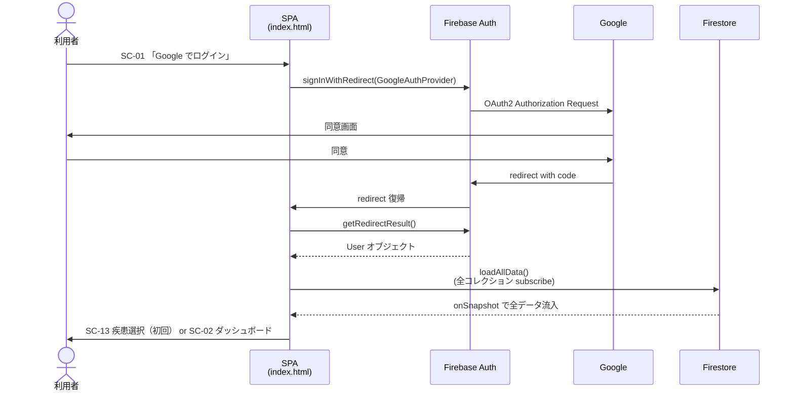
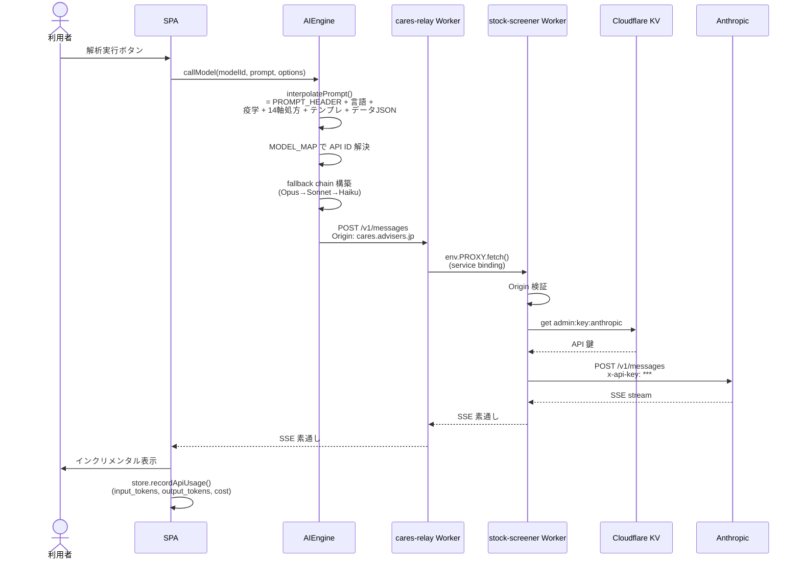
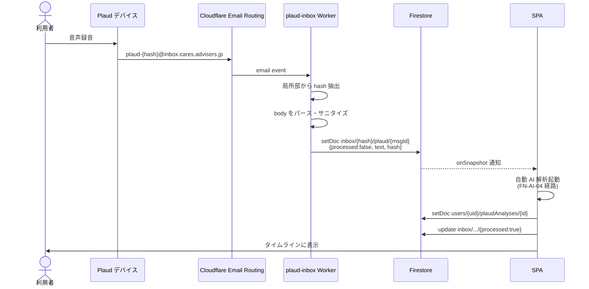
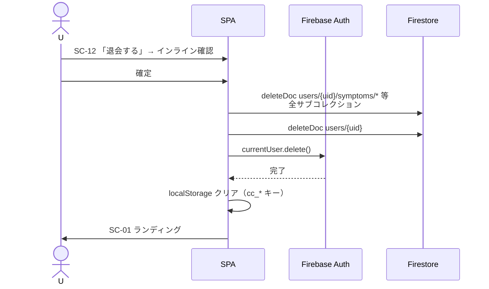
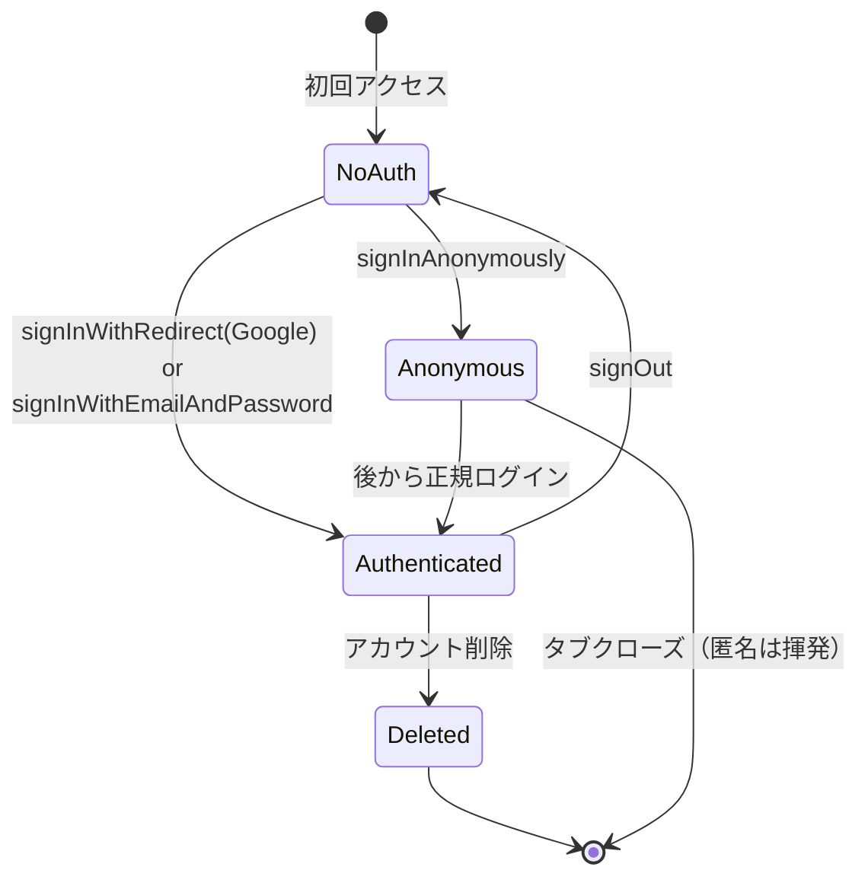
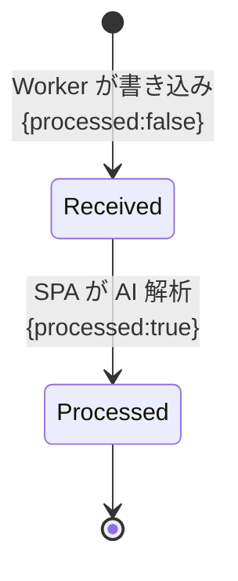
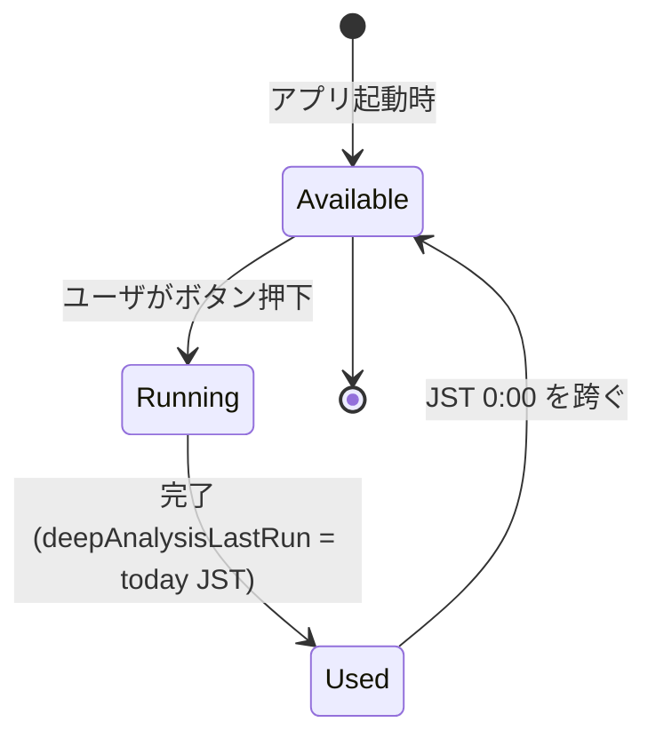

# 詳細設計書 — 健康日記（Health Diary）

> 本書は「実装直前の粒度」で記述する。上位の方針は [基本設計書](../basic-design/基本設計書.md)、要件は [要件定義書](../requirements/要件定義書.md) を参照。

## 1. 機能詳細設計

### 1.1 主要シーケンス

#### 1.1.1 SSO ログイン（FN-AUTH-01）



#### 1.1.2 AI 解析実行（FN-AI-01〜FN-AI-08）



#### 1.1.3 Plaud 受信取り込み（FN-INT-01）



#### 1.1.4 退会処理（FN-AUTH-05）



### 1.2 状態遷移

#### 1.2.1 セッション状態



#### 1.2.2 InboxMessage 状態



#### 1.2.3 DeepAnalysis（1 日 1 回上限）



### 1.3 ビジネスルール詳細

| ルール ID | 詳細 | 実装箇所 |
|---|---|---|
| BR-01 | 深堀解析の 1 日 1 回判定は `store.get('deepAnalysisLastRun')` を JST に変換して比較。アプリ再起動でも維持 | `app.js` 深堀解析ボタン handler |
| BR-02 | `interpolatePrompt()` で必ず PROMPT_HEADER を先頭に置き、空文字や undefined を許可しない | `ai-engine.js:321` |
| BR-03 | 14 軸処方は `Math.floor((Date.now() - startOfYear) / 86400000) % 14` で軸インデックスを計算。CONFIG.PRESCRIPTION_AXES 参照 | `ai-engine.js:207-256` |
| BR-04 | Worker の `/v1/messages` ハンドラは request の `x-api-key` を完全に削除し、KV / env から取得した鍵で置換する | `worker/anthropic-proxy.js` |
| BR-05 | MODEL_MAP のキーは CONFIG.AI_MODELS の id と完全一致必須。datestamped ID（`claude-3-5-sonnet-20241022` 等）は `.githooks/pre-commit` で検出 | `.githooks/pre-commit` |
| BR-06 | 退会時は `users/{uid}` 下の各サブコレクション（symptoms/vitals/...）を逐次 deleteDoc、その後 user 本体、最後に `auth.currentUser.delete()` | `firebase-backend.js` |
| BR-07 | 管理者判定は `auth.currentUser.email.toLowerCase().trim() === 'agewaller@gmail.com'` | `app.js isAdmin()` |
| BR-10 | `Store.set(key, value)` 内で `addDoc` / `setDoc` を起動するが、`_loading` 中はスキップ（Firestore 初期同期で発火するのを防ぐため） | `store.js` + `firebase-backend.js` |

### 1.4 バリデーションルール

| 対象 | 項目 | ルール |
|---|---|---|
| Vital | heart_rate | 30–250 BPM |
| Vital | temperature | 30.0–43.0 ℃ |
| Vital | spo2 | 50–100 % |
| BloodTest | wbc | 0–100000 /μL |
| SleepData | duration | 0–24 時間 |
| Symptom | condition_level | 1–10 整数 |
| Photo | base64Data | 100 MB 以内（Anthropic 上限） |
| TextEntry | content | 100,000 文字以内（AI 入力上限） |
| InboxMessage | text | 200 KB 以内（firestore.rules で強制） |

## 2. 画面詳細設計

### 2.1 SC-02 ダッシュボード

| 項目 | 型 | 補足 |
|---|---|---|
| 挨拶 | 表示 | `おはようございます、{displayName} さん` |
| 当日の体調入力カード | フォーム | `condition_level` スライダー（1–10） |
| クイック入力ボタン群 | ボタン | バイタル・食事・睡眠・薬 |
| AI コメント | 表示 | 直近の `latestFeedback`、エラー時は `latestFeedbackError` |
| セルフケア提案カード | 表示 | 14 軸ローテーションの当日軸 |
| 直近データプレビュー | リスト | 過去 7 日のデータ概要 |
| 「本格的な分析」CTA | ボタン | 1 日 1 回、`deepAnalysisLastRun` で活性制御 |
| ナビゲーション | リンク群 | SC-04 / SC-08 / SC-11 / SC-10 / SC-12 |

### 2.2 SC-07 データ入力

9 つのタブ:
1. 今日の体調（Symptom）
2. バイタル（Vital）
3. 服薬（Medication）
4. 睡眠（SleepData）
5. 活動（ActivityData / 歩数）
6. 食事（Meal + 写真）
7. 検査結果（BloodTest）
8. 気分（Mental）
9. 写真（Photo + AI 自動分類）

各タブはフォーム → 保存ボタン → `store.set(category, [...previous, newRecord])` で更新（Firestore 自動同期）。

### 2.3 SC-04 アクション / 解析メニュー

| ボタン | 動作 |
|---|---|
| 本格的な分析を実行 | FN-AI-02、Opus 4.6 で stream 解析、結果を `deepAnalyses` 保存 |
| 医師提出用レポート生成 | FN-AI-05、カルテ風フォーマット |
| 家族・近親者向け要約 | FN-AI-07、専門用語を避けた平易な日本語 |
| SNS 投稿用要約 | FN-AI-06、Privacy で PII マスキング |
| 過去 30 日タイムライン解析 | FN-DIARY-04 + AI、時系列傾向 |

### 2.4 SC-06 管理パネル（管理者のみ）

タブ:
- プロンプト管理（`prompts/{key}` の編集・バージョン作成）
- API 鍵設定（Worker `/admin/keys` に POST、`/admin/key-status` で確認）
- Firebase 設定（クライアント config）
- データ管理（全ユーザの利用ログ概要）
- 利用ログ（`apiUsage` の集計）

### 2.5 共通エラーメッセージ

| コード | メッセージ | 表示先 |
|---|---|---|
| `E_AUTH_REQUIRED` | ログインが必要です | 全画面（onAuthStateChanged で SC-01 へ） |
| `E_AI_TIMEOUT` | 接続できませんでした。もう一度お試しください | トースト |
| `E_AI_ALL_FAIL` | サービスが混雑しています。しばらく経ってからお試しください | インライン |
| `E_QUOTA_EXCEEDED` | 保存容量がいっぱいです。古いデータをエクスポートしてください | トースト |
| `E_DEEP_USED` | 本格的な分析は 1 日 1 回までです。明日またお試しください | ボタン下に表示 |
| `E_VALIDATION` | 入力内容を確認してください | フォーム上部 |

## 3. API 詳細設計

詳細仕様は [`api/api-list.md`](api/api-list.md) を参照。

### 3.1 共通仕様

- ベース URL: `https://ai.cares.advisers.jp`（または `https://cares-relay.agewaller.workers.dev`）
- フォーマット: JSON（`/v1/messages` の stream 時は SSE）
- 認証: 一般 API は Origin チェックのみ、admin 系は `Authorization: Bearer <Firebase ID Token>`
- エラー形式: `{ "error": "string", "details": "string" }`

### 3.2 エラーコード

| HTTP | 内容 |
|---|---|
| 400 | リクエスト形式不正 |
| 401 | 認証エラー（admin 系のみ） |
| 403 | Origin 不一致 |
| 429 | レートリミット（プロバイダ側） |
| 500 | サーバ内部エラー |
| 502 | 上流プロバイダエラー |
| 529 | Anthropic 過負荷（フォールバック対象） |

## 4. データベース詳細設計

### 4.1 主要コレクション詳細

#### `users/{uid}`（ドキュメント）

```typescript
{
  uid: string;                    // Firebase Auth uid
  email: string;
  displayName: string | null;
  createdAt: Timestamp;
  updatedAt: Timestamp;
  selectedDiseases: string[];     // 例: ['mecfs', 'fibromyalgia']
  customDiseaseName?: string;
  selectedModel: string;          // 'claude-opus-4-6' 等
  customPrompts?: Record<string, string>;
  userProfile?: {
    age?: number;
    gender?: 'male' | 'female' | 'other';
    currentMedications?: string[];
    allergies?: string[];
  };
  deepAnalysisLastRun?: string;   // 'YYYY-MM-DD' JST
}
```

#### `users/{uid}/symptoms/{id}`

```typescript
{
  id: string;
  createdAt: Timestamp;
  condition_level: number;        // 1-10
  sleep_quality?: number;
  memo?: string;
}
```

#### `inbox/{hash}/plaud/{messageId}`

```typescript
{
  hash: string;                   // path と一致必須（rule で強制）
  text: string;                   // ≤ 200 KB
  processed: boolean;             // 初期 false、SPA が true に
  receivedAt: Timestamp;
  source?: string;                // From アドレス
}
```

#### `prompts/{key}`

```typescript
{
  key: string;
  description: string;
  currentVersion: string;
  template: string;
  updatedAt: Timestamp;
  updatedBy: string;
}
```

サブコレクション `versions/{version}` に変更履歴。

### 4.2 セキュリティルール抜粋

```javascript
// firestore.rules 該当箇所

// users
match /users/{userId} {
  allow read, write: if request.auth != null
                     && request.auth.uid == userId;
  allow read: if request.auth.token.email == 'agewaller@gmail.com';  // 管理者
  match /{subcollection}/{docId} {
    allow read, write: if request.auth != null
                       && request.auth.uid == userId;
  }
}

// inbox（Plaud 受信、Worker 書込用）
match /inbox/{hash}/{kind}/{messageId} {
  allow read: if request.auth != null
              && resource.data.hash == hash;
  allow create: if request.resource.data.processed == false
                && (kind == 'plaud' || kind == 'data')
                && request.resource.data.hash == hash
                && request.resource.data.text.size() <= 200000;
  allow update: if request.auth != null
                && request.resource.data.processed == true;
  allow delete: if false;
}

// admin
match /admin/{docId} {
  allow read, write: if request.auth.token.email == 'agewaller@gmail.com';
}

// prompts（公開読取・管理者書込）
match /prompts/{key} {
  allow read: if true;
  allow write: if request.auth.token.email == 'agewaller@gmail.com';
}
```

### 4.3 マイグレーション方針

- Firestore はスキーマレスなので DDL マイグレーションは不要
- フィールド追加時は SPA 側で `???? || defaultValue` 形式の Nullish マージで対応
- 旧フィールドの削除は SPA 側で参照を消すのみ（Firestore に残置）
- スキーマバージョン: `Store.SCHEMA_VERSION` で localStorage キャッシュの世代管理

### 4.4 代表クエリ

```javascript
// 当日の症状を取得
const today = new Date(); today.setHours(0,0,0,0);
const q = query(
  collection(db, `users/${uid}/symptoms`),
  where('createdAt', '>=', today),
  orderBy('createdAt', 'desc')
);

// 過去 30 日のすべてのカテゴリを並列取得
const cats = ['symptoms', 'vitals', 'medications', 'sleepData', 'meals'];
const since = new Date(Date.now() - 30 * 86400000);
const results = await Promise.all(cats.map(c =>
  getDocs(query(
    collection(db, `users/${uid}/${c}`),
    where('createdAt', '>=', since)
  ))
));
```

## 5. バッチ / 非同期処理詳細

### 5.1 バッチ一覧

| ID | バッチ名 | 実行 | 内容 |
|---|---|---|---|
| BAT-01 | research-updater | cron（GitHub Actions `update-risk-data.yml` の cron `0 * * * *`、ただし主に jsrm 用） | KV に研究データ更新 |
| BAT-02 | LMS sync | push to main（`sync-dev-tools-to-lms.yml`） | 開発設定を別リポへミラー |

### 5.2 リアルタイム同期

- Firebase Firestore `onSnapshot` で各サブコレクションを subscribe
- 1 ユーザあたり同時 listener 数: 8 collection + settings + inbox = 約 10 個
- 切断・再接続は Firebase SDK が自動管理
- ログアウト時に `cleanupListeners()` で全 unsub

## 6. 帳票・通知詳細

- 医師提出用レポート: 画面上で表示 → ユーザがコピー or 印刷
- SNS 投稿用: テキストでコピー（PII マスキング済み）
- 専門家への問い合わせ: `professional-mailer` Worker でメール送信

## 7. セキュリティ詳細

### 7.1 PII マスキング（`js/privacy.js`）

- メールアドレス、電話番号、住所、本名フォーマットを正規表現で検出
- SNS 投稿用要約生成時に自動適用
- AI に PII を送るかどうかはオプトイン（既定: 送らない）

### 7.2 XSS 対策

- ユーザ入力は `Components.escapeHtml()` で escape
- AI 応答は `Components.formatMarkdown()` で escape 後に安全な markdown パターンを適用
- `innerHTML =` の直接代入は escape 済み文字列か内部生成 HTML のみ

### 7.3 Cookie / セッション

- Firebase Auth は IndexedDB + LocalStorage でセッション保持
- ID Token は 1 時間で自動 refresh
- `signInWithPopup` は使わず `signInWithRedirect` を使用（モバイルブロック回避）

### 7.4 鍵管理

| 情報 | 保管 |
|---|---|
| Anthropic / OpenAI / Google API 鍵 | Cloudflare KV `admin:key:<provider>` または env secret `ANTHROPIC_API_KEY` |
| Firebase クライアント config | `js/config.js` に埋込（公開鍵の性質） |
| Firebase Admin SA | GitHub Secrets `FIREBASE_TOKEN`（`deploy-firestore-rules.yml` で使用） |
| Cloudflare API Token | GitHub Secrets `CLOUDFLARE_API_TOKEN` |
| break-glass トークン | Worker env secret `ADMIN_WRITE_TOKEN` |

## 8. インフラ詳細

### 8.1 wrangler 設定

| ファイル | Worker | カスタムドメイン |
|---|---|---|
| `wrangler.jsonc` | stock-screener（active） | — |
| `wrangler.toml` | stock-screener（legacy） | — |
| `wrangler.relay.jsonc` | cares-relay | `ai.cares.advisers.jp` |
| `wrangler.plaud-inbox.toml` | plaud-inbox | Email Routing |
| `wrangler.professional-mailer.toml` | professional-mailer | — |
| `wrangler.learning.toml` | learning-orchestrator | — |
| `wrangler.research-updater.toml` | research-updater | — |

### 8.2 Cloudflare KV

| 名前空間 | バインド | 用途 |
|---|---|---|
| RESEARCH_KV | stock-screener / research-updater | `admin:key:*`（API 鍵）+ `research:*`（研究キャッシュ） |

### 8.3 Cloudflare Email Routing

- 受信ドメイン: `inbox.cares.advisers.jp`
- ルール:
  - `plaud-*@inbox.cares.advisers.jp` → `plaud-inbox` Worker
  - `data-*@inbox.cares.advisers.jp` → `plaud-inbox` Worker（`kind=data`）

### 8.4 CI/CD ステージ

| ステージ | 内容 | 失敗時 |
|---|---|---|
| pre-commit | `.githooks/pre-commit` で禁則パターン検出（datestamped model id、`alert`/`confirm`、`localStorage.clear`、旧 Google 翻訳 URL、`AIza` 鍵） | commit 不可 |
| smoke test | `node tests/smoke.test.js`（手動） | 警告のみ |
| GitHub Actions | `pages.yml` / `deploy-worker.yml` 等 | 通知 |

## 9. 運用設計詳細

### 9.1 リリース手順

1. `restructure_project` 等のフィーチャーブランチで開発
2. main に Pull Request
3. レビュー後マージ
4. `pages.yml`（フロント）/ `deploy-worker.yml`（Worker）/ `deploy-firestore-rules.yml`（rules）が自動発火
5. cares.advisers.jp / Workers / Firestore が同期更新

### 9.2 障害対応ランブック

| 症状 | 切り分け | 復旧 |
|---|---|---|
| AI が応答しない | (1) `ai.cares.advisers.jp` の HTTPS 疎通 (2) Cloudflare ダッシュボードで Worker logs | (1) DNS 未伝播なら待機 (2) `fix-relay-custom-domain.yml` を手動実行 |
| `workers.dev` の Worker が 403 | account-level subdomain 無効化の可能性 | `cloudflare-workers-diag.yml` を手動実行 |
| Firestore 接続失敗 | Firebase コンソールで status | 復旧待機、SPA は localStorage キャッシュで動作継続 |
| 管理者がロックアウト | break-glass `x-admin-token` で `/admin/keys` 直接呼び出し | env secret `ADMIN_WRITE_TOKEN` を使用 |
| GitHub Pages 配信停止 | GitHub Status | 復旧待機（ユーザのキャッシュで SW が部分動作） |

### 9.3 監視

- Cloudflare Workers: `observability.enabled` で標準ロギング、ダッシュボードでエラー率・レイテンシ確認
- Firestore: Firebase コンソールで利用量、ルール拒否数を確認
- GitHub Actions: 失敗時に通知メール

## 10. テスト設計

### 10.1 テスト戦略

| レベル | 目的 | 対象 | 実行 |
|---|---|---|---|
| 静的解析 | コードパス配線の検証 | `js/*.js` の関数定義、ハンドラ⇔メソッド対応、render_* 存在性、AI モデルマップ、Firestore rules 一部 | `node tests/smoke.test.js` |
| pre-commit | 禁則パターン検出 | datestamped model id、`alert`/`confirm`、旧 URL 形式、API 鍵 | `.githooks/pre-commit` |
| 手動 E2E | ハッピーパス | ログイン → 疾患選択 → データ入力 → AI 解析 | リリース前に手動 |

### 10.2 重点観点

- **AI フォールバック**: Opus → Sonnet → Haiku の順で 1 段ずつ落ちることを確認
- **Vision モード**: `imageBase64` 指定時に image block が組み込まれること
- **管理者判定**: stale localStorage 状態で誤判定しないこと（live Auth email を見ること）
- **退会**: 全サブコレクションが削除されること
- **1 日 1 回上限**: JST 0:00 を跨ぐと再度実行可能になること
- **i18n**: 言語切替時に `researchResults` の言語マーカーがチェックされ、キャッシュが invalidate されること

## 11. 開発標準

### 11.1 コーディング規約

- 関数名: `lowerCamelCase`
- CSS クラス: `kebab-case`
- 定数: `UPPER_SNAKE_CASE`
- HTML はテンプレートリテラルで生成、`escapeHtml()` 必須
- ユーザ向け文言: 日本語 + 多言語キー化
- AI の応答内容はすべて `CONFIG` 配下のプロンプトテンプレートで制御（JS にハードコードしない）
- URL の正規表現は ASCII のみ（日本語文字を巻き込まない）

### 11.2 Git ブランチ戦略

- `main`: 常にデプロイ可能（push でフロント + Worker 自動デプロイ）
- フィーチャブランチ: `feat/*` / `fix/*` / `restructure_project` 等
- マージ方法: PR 経由、Squash 推奨

### 11.3 禁則パターン（`.githooks/pre-commit`）

- datestamped Claude / OpenAI model id（`claude-3-5-sonnet-20241022` 等）のハードコード
- `localStorage.clear()`（`store.clearAll()` を使う）
- `confirm()` / `alert()`
- `signInWithPopup`
- 旧 Google 翻訳 URL 形式（`translate.google.com/translate?u=`）
- ハードコードされた `AIza...` API キー

### 11.4 レビュー観点

- 要件・基本設計との整合性（FN-* / SC-* / API のトレース）
- 鍵情報がブラウザに混入していないか
- ユーザ向け文言に「AI」リテラルが含まれていないか
- ユーザ入力が DOM 挿入前に escape されているか
- `confirm()`/`alert()` を使っていないか
